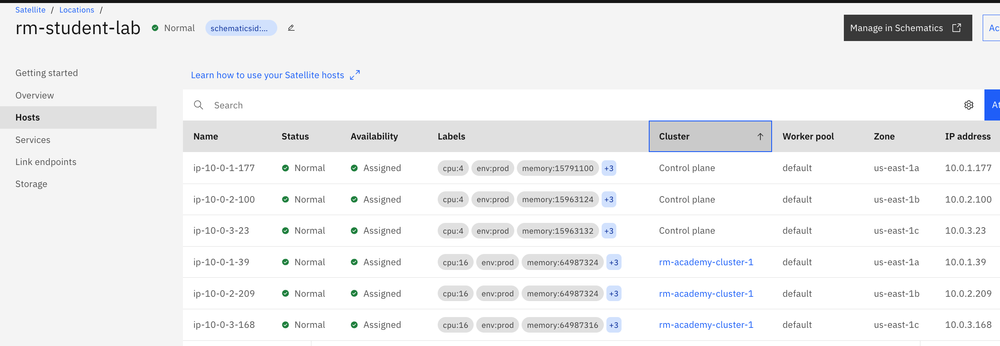

# Access OpenShift Console via public Internet

Per default the AWS Satellite location is registered with DNS using private IP addresses of the EC2 hosts assigned to the Satellite **control plane** hosts. The same is true for the OpenShift Cluster NLB hostname DNS entries, which also contain private IP addresses. This exercise will make the Satellite based OpenShift Cluster Consoloe accessible over the internet.
For more information on that topic read the documentation please:
<https://cloud.ibm.com/docs/openshift?topic=openshift-access_cluster#sat_public_access>


Review your location and create a table in a text editor of choice containing hostnames and private IPs of Control Plane and ROKS workernodes. We need those values in our next steps.



## Assign Public IPs from AWS EC2 Instances to Control Plane DNS and NLB of ROKS Cluster

1. Download the aws cli from <https://aws.amazon.com/cli/>

2. To login into your aws account use the below command on your terminal

    ```sh
    aws configure
    ```

    Fill in the details:
    * AWS Access Key ID: **************
    * AWS Secret Access Key: **************
    * Default region name: your region `us-east-1`
    * Default output format: `json`

3. Now we need to identify the public IP of our hosts running on ec2 instances in searching with the private IP in the output of the AWS CLI.

4. To list all the ec2 instances in the aws account use

    ```sh
    aws ec2 describe-instances
    ```

5. This might have a huge list depending on the environment used.

6. Easier way to identify your hosts is copy the output in a file (e.g. ec2.txt) and search manually

    ```sh
    aws ec2 describe-instances > ec2.txt
    ```

7. This would save the output in the ec2.txt file, now search your relevant hosts through hostname or private Ips to identify their respective public IP's

8. An even more convinient alternative you could use jq CLI to process the aws CLI output.

   Install [jq CLI json processor](https://github.com/stedolan/jq/wiki)

   [jq cheat sheet](https://lzone.de/cheat-sheet/jq)

   <code>
   aws ec2 describe-instances | jq '.Reservations[].Instances[] | select (.PrivateIpAddress=="10.0.1.240") | {PrivateIpAddress,PublicIpAddress,SecurityGroups,SubnetId,ImageId,InstanceType,Placement}'
   </code>

   

9. Write down all public IPs of Control Plane and Worker Nodes for the next steps.

## Apply Public Ips to Satellite location and ROKS cluster in IBM Cloud

1. Login to IBM Cloud using the ibmcloud cli and target your ITZ Account

    ```shell
    ibmcloud login --sso
    ibmcloud target -g academyrg
    ```

2. Review the location subdomains and check the Records for the private IP addresses of the hosts that are registered in the DNS for the subdomain.

    ```sh
    ibmcloud sat location ls
    ibmcloud sat location dns ls --location <location_name_or_ID>
    ```

3. Update the location subdomain DNS records with the 3 public IP addresses of each host in the **control plane**

    ```sh
    ibmcloud sat location dns register --location <location_name_or_ID> --ip <host_IP> --ip <host_IP> --ip <host_IP>
    ```

4. Verify that the public IP addresses are registered with your location DNS records.

    ```sh
    ibmcloud sat location dns ls --location <location_name_or_ID>
    ```

5. Get the Hostname for your cluster in the format

    ```sh
    ibmcloud oc clusters
    ibmcloud oc nlb-dns ls --cluster <cluster_name_or_ID>
    ```

6. Add the public IP addresses of the hosts that are assigned as **worker nodes** to your cluster to your cluster's subdomain. Repeat this command for each host's public IP address.

    ```sh
    ibmcloud oc nlb-dns add --ip <public_IP> --cluster <cluster_name_or_ID> --nlb-host <hostname>
    ```

7. Remove the private IP addresses from your cluster's subdomain. Repeat this command for all private IP addresses that you retrieved earlier.

    ```sh
    ibmcloud oc nlb-dns rm classic  --cluster <cluster_name_or_ID> --nlb-host <hostname> --ip <private_IP>
    ```

8. Verify that the public IP addresses are registered with your cluster subdomain.

    ```sh
    ibmcloud oc nlb-dns ls --cluster <cluster_name_or_ID>
    ```

9. Wait a couple of minutes until the DNS changes are applied and verify that you can access the OpenShift Console from the Cloud Console:

    

10. For Troubleshooting use nslookup on your Sat and OpenShift Domains:

    ```shell
    ibmcloud sat location dns ls --location <your location>

    nslookup <satlocation hostnames> 

    ibmcloud oc nlb-dns ls --cluster <cluster_name_or_ID>

    nslookup <oc nlb-dns domain>
    ```
