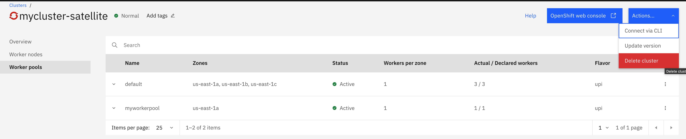
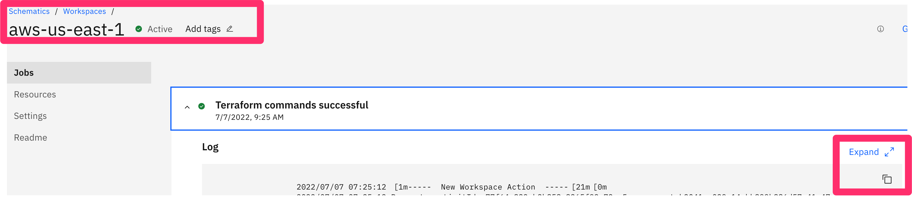
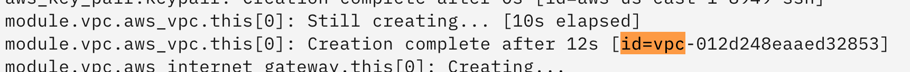
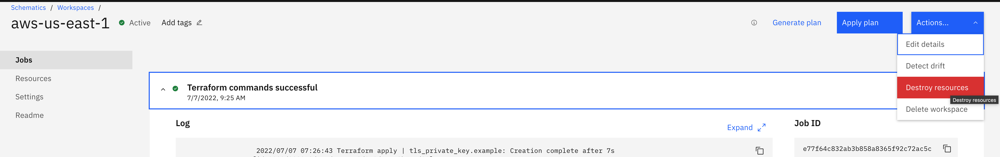
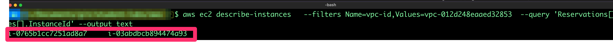
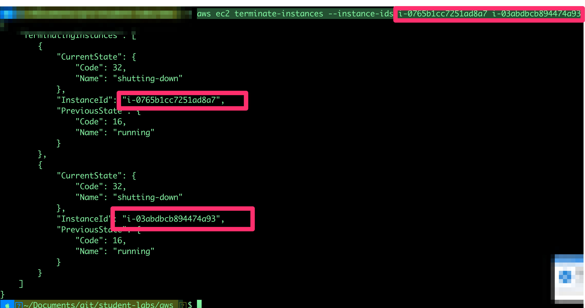
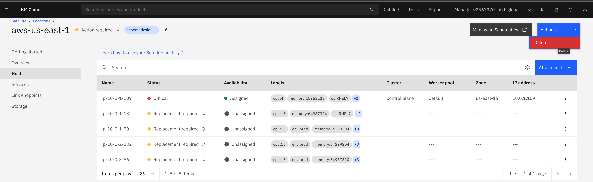

# Cleanup AWS Resources

## 1. Delete your Openshift Satellite Cluster

  

## 2. Find your AWS VPC ID from Schematics

Search for a string of your VPC Id in the Schematics Logs of the Terraform logs:
search for **"id=vpc"** and note the id there is only one place in the log with the string.

  


  

## 3. Destroy the environment using Schematics



Wait until finished (10 minutes)

## 4. Destroy leftover resources with AWS CLI
Find Instance Ids of your ec2 Instances not created via Terraform using the VPC ID from step 2.

```shell
aws ec2 describe-instances   --filters Name=vpc-id,Values=<vpc-id>  --query 'Reservations[].Instances[].InstanceId' --output text
```
  

This will output the Ids of leftover EC2 instances.

Terminate the instances
```shell
   aws ec2 terminate-instances --instance-ids <id> <id>
```
  

## 5. Destroy Satellite location
  


