# Install Openshift Data Foundation on Satellite based ROKS Clusters on AWS using EBS volumes

## Table of Content

* [Introduction](#introduction)
* [Configure AWS EBS storage configuration in Satellite](#configure-aws-ebs-storage-configuration-in-satellite)
* [Deploy ODF using EBS volumes in AWS](#deploy-odf-using-ebs-volumes-in-aws)
* [Test ODF with an example application](#test-odf-with-an-example-application)
* [Check ODF Deployment in the OpenShift Console](#-check-odf-deployment-in-the-openShift-console)

## Introduction

We would like to deploy OpenShift Data Foundation Add-on to our Satellite based OpenShift Cluster on AWS using EBS volumes. The procedure contains the following major steps

* Configuration of a AWS EBS storage configuration for our location and assign to our ROKS Cluster
* Deploy ODF using Sattellite ODF storage configuration referencing AWS Storage class

## Configure AWS EBS storage configuration in Satellite

1. From the Satellite locations dashboard, select the location where you want to create a storage configuration.

2. Select Storage > Create storage configuration

    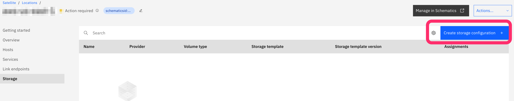

3. Enter a name for your configuration. Select the Storage type that you want to use to create your configuration and the Version.

    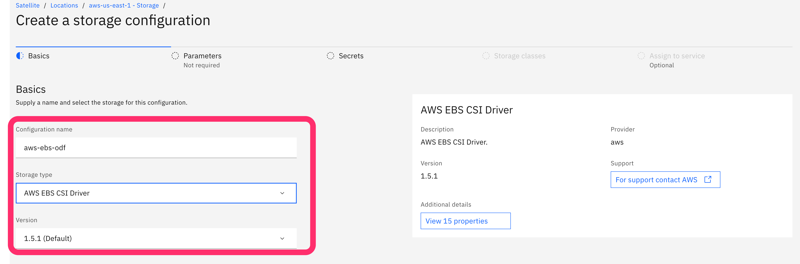  

4. On the Secrets tab, enter the secrets, if required, for your configuration.

    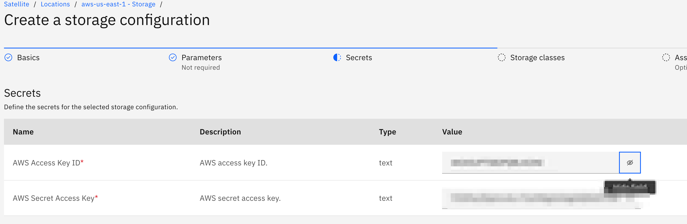  

5. On the Storage classes tab, review the storage classes that are deployed by the configuration.

    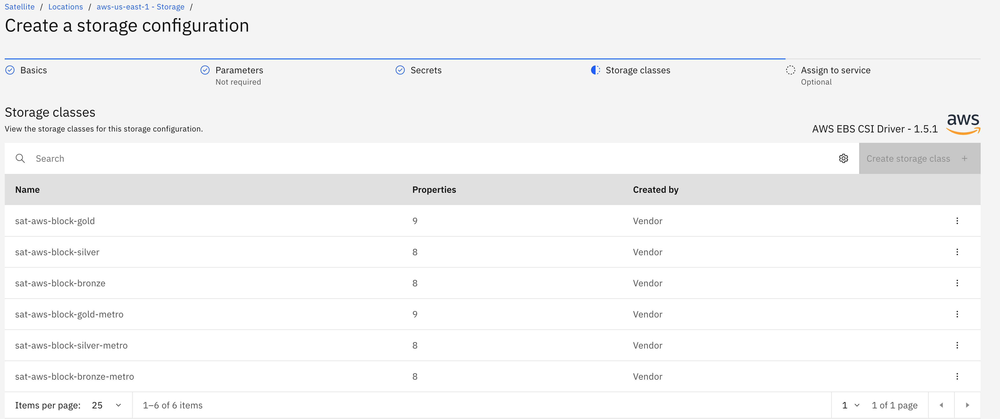

6. On the Assign to service tab, select your cluster that you want to assign your configuration to.

    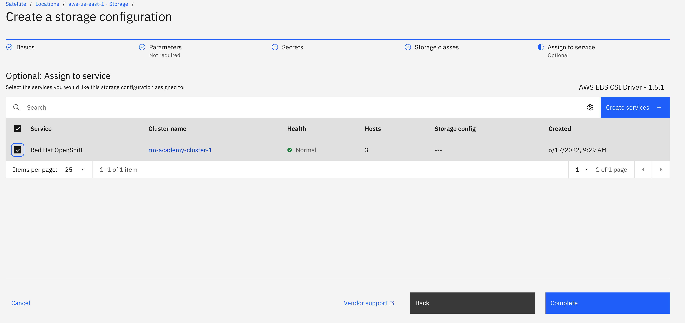

7. Click Complete to assign your storage configuration.

    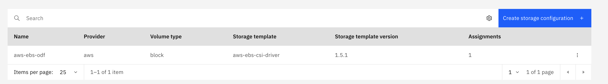

## Deploy ODF using EBS volumes in AWS

For more detailled descriptions of the following steps look also in the [Satellite Docs](https://cloud.ibm.com/docs/satellite?topic=satellite-config-storage-odf-remote&interface=cli)
For sake of simplicity we will not configre Nooba COS backing store.

1. Connect to your Satellite Location on the CLI

    ```sh
    ibmcloud login --sso
    ibmcloud target -g academyrg -r us-east
    ```

    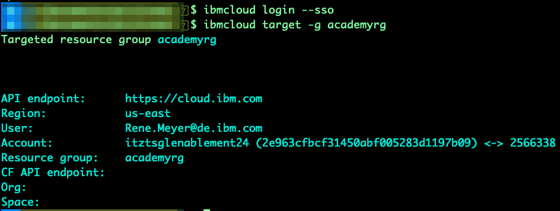

1. Verify that your cluster has a valid storage configuration has applied (from the previous chapter). Use the location id and cluster id ***NOT*** the name

    ```sh
    ibmcloud sat location ls
    ibmcloud oc cluster ls --provider satellite
    ibmcloud sat storage assignment  ls --location <location id> --cluster <cluster id>
    ```

    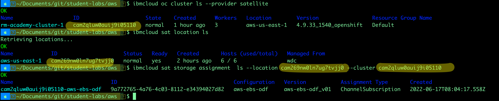

1. What you also will see that we already have AWS Storage classes deployed, which could be used by ODF. Connect to your cluster and list the storage classes:

    ```sh
    # remove endpoint parameter if you connect via public IPs
    # use endpoint parameter if you connect from cloudshell
    ibmcloud ks cluster config -c <your cluster> --admin --endpoint link
    oc get storageclass
    ```

    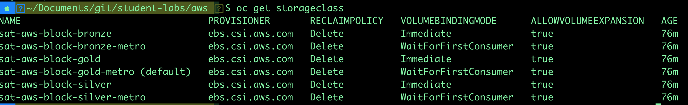  

1. Create an IBM API Key

    ```sh
    ibmcloud iam api-key-create odf --file apikey.json
    ```

    Open the JSON File and extract the apikey value. Don't share the key with anyone else!.

1. With that we could tell the Satellite based ODF deployment to use the AWS EBS Storage class configured by our Satellite Storage Configuration from the previous chapter. Please review before proceeeding the following article and parameters, we need to select a storage Class which has Volume Binding Mode Wait on first Consumer, because we have a multizone ROKS Cluster in AWS.

    <https://cloud.ibm.com/docs/satellite?topic=satellite-config-storage-odf-remote&interface=cli#odf-remote-49-params>

    Execute the following command to create a ODF Storage configuration in your location.

    ```sh
    ibmcloud sat storage config create --name odf --location <your sat location id> --template-name odf-remote --template-version 4.9 -p "osd-storage-class=sat-aws-block-gold-metro" -p "osd-size=100Gi" -p "num-of-osd=1" -p "iam-api-key=<Your API Key>"
    ```

    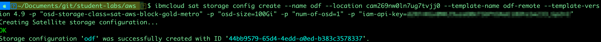

1. Assign the Configuration to the Cluster using the Console UI
Navigate in the IBM Cloud Console to your Satellite Storage Configurations. You will see now a second configuration for ODF.

    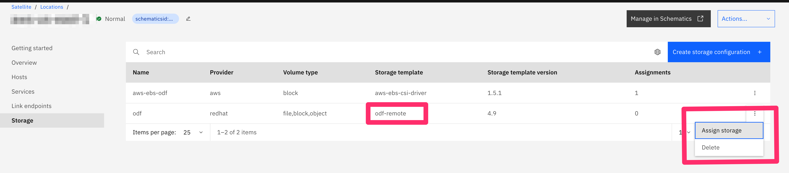

    Assign the Configuration to your ROKS cluster.

    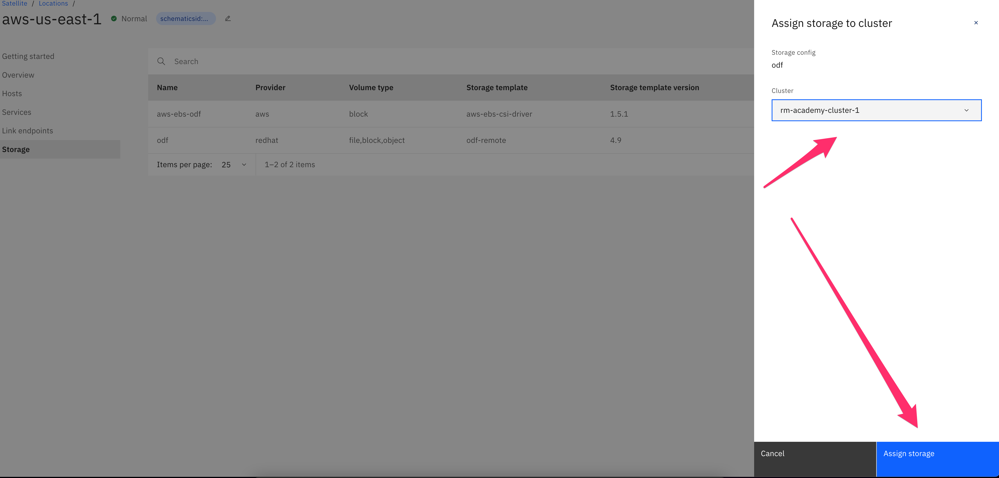

1. Monitor the deployment using the oc CLI

    ```sh
    oc get storagecluster -n openshift-storage
    oc get pods -n openshift-storage
    ```

1. Grab a cup of coffee and wait until you see that all pods have been started

    ```sh
    oc get pods -n openshift-storage
    NAME                                                              READY   STATUS      RESTARTS   AGE
    csi-cephfsplugin-fshbp                                            3/3     Running     0          8m3s
    csi-cephfsplugin-g6h88                                            3/3     Running     0          8m3s
    csi-cephfsplugin-nzpql                                            3/3     Running     0          8m3s
    csi-cephfsplugin-provisioner-5b9c6d55cd-jz2rz                     6/6     Running     0          8m2s
    csi-cephfsplugin-provisioner-5b9c6d55cd-r8zdg                     6/6     Running     0          8m2s
    csi-rbdplugin-5fn6g                                               3/3     Running     0          8m4s
    csi-rbdplugin-c5wv5                                               3/3     Running     0          8m4s
    csi-rbdplugin-l4sfl                                               3/3     Running     0          8m4s
    csi-rbdplugin-provisioner-5b674484d-j8wgb                         6/6     Running     0          8m4s
    csi-rbdplugin-provisioner-5b674484d-s6vvn                         6/6     Running     0          8m4s
    noobaa-core-0                                                     1/1     Running     0          2m13s
    noobaa-db-pg-0                                                    1/1     Running     0          2m13s
    noobaa-endpoint-79cddbdfb8-plnfp                                  1/1     Running     0          57s
    noobaa-operator-6b5d8ffbc7-ftbtx                                  1/1     Running     0          8m49s
    ocs-metrics-exporter-6659bcdcfb-djkjg                             1/1     Running     0          8m39s
    ocs-operator-5bc589f4c4-p2vrh                                     1/1     Running     0          8m40s
    odf-console-85b7f578c9-lkpvf                                      1/1     Running     0          8m39s
    odf-operator-controller-manager-6f885fcc64-7xvmc                  2/2     Running     0          8m39s
    rook-ceph-crashcollector-ip-10-0-1-240.ec2.internal-76dc77c9pbl   1/1     Running     0          3m32s
    rook-ceph-crashcollector-ip-10-0-2-207.ec2.internal-69dbd62z65s   1/1     Running     0          3m33s
    rook-ceph-crashcollector-ip-10-0-3-177.ec2.internal-548768d84t5   1/1     Running     0          3m40s
    rook-ceph-mds-ocs-storagecluster-cephfilesystem-a-7dbfdc74h4nnp   2/2     Running     0          2m53s
    rook-ceph-mds-ocs-storagecluster-cephfilesystem-b-865b799c7gjd2   2/2     Running     0          2m52s
    rook-ceph-mgr-a-54b76869f4-47x5l                                  2/2     Running     0          3m40s
    rook-ceph-mon-a-688cb46bf9-c2sk5                                  2/2     Running     0          6m52s
    rook-ceph-mon-b-6c84db899-b8gfj                                   2/2     Running     0          4m18s
    rook-ceph-mon-c-b766fc6c-wlhbw                                    2/2     Running     0          4m1s
    rook-ceph-operator-7b5b5f9676-94nnr                               1/1     Running     0          8m39s
    rook-ceph-osd-0-77895b746b-kfqdk                                  2/2     Running     0          3m23s
    rook-ceph-osd-1-75cfcbfcc9-dtkgs                                  2/2     Running     0          3m23s
    rook-ceph-osd-2-5fd659646f-dj9jp                                  2/2     Running     0          3m15s
    rook-ceph-osd-prepare-ocs-deviceset-0-data-0kd9zz--1-h9cfm        0/1     Completed   0          3m37s
    rook-ceph-osd-prepare-ocs-deviceset-1-data-0nhdwc--1-2dskm        0/1     Completed   0          3m37s
    rook-ceph-osd-prepare-ocs-deviceset-2-data-0frg8b--1-wp2w6        0/1     Completed   0          3m36s
    rook-ceph-rgw-ocs-storagecluster-cephobjectstore-a-66c4b76g6qjt   2/2     Running     0          2m51s
    ```

## Test ODF with an example application

1. Review the new ODF storage classes in your cluster

    ```sh
    oc get storageclass
    ````

    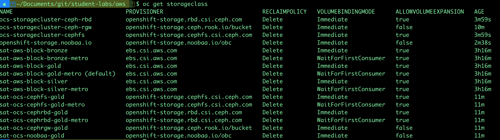

1. Test the storage class using the following yamls

    [pvc.yaml](aws/pvc.yaml)

    [pod.yaml](pod.yaml)

1. Apply the pvc.yaml and check the pvcs

    ```sh
    oc project default
    oc apply -f pvc.yaml
    oc get pvc
    ```

    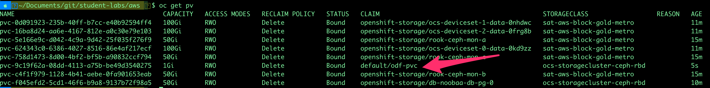  

1. Now deploy an application using that pvc and connect to the pod:

    ```sh
    oc apply -f pod.yaml
    oc get po
    ````

    

1. Login into your pod and verify you could write to the volume

    ```sh
    oc exec app -it -- bash
    cat /test/test.txt
    touch /test/hello.txt
    ```

    

## Check ODF Deployment in the OpenShift Console

You can find a **Data Foundation** page with some performance (i.e. IOPS, Latency, and Throughput) in the Administrator perspective of the Cluster Console.


