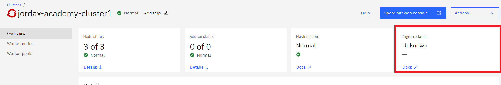
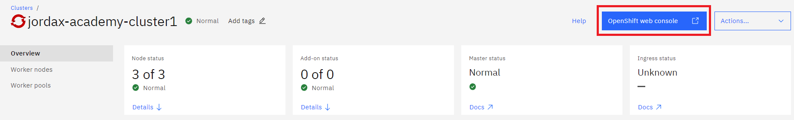
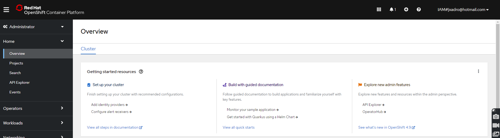

# Azure Labs

## Table of contents

- [Lab 0 - Student VSI](#lab-0---student-vsi)
- [Lab 1 - Check status](#lab-1---check-status)
  - [UI](#ui)
  - [CLI](#cli)
- [Lab 2 - Expose ROKS](#lab-2---expose-roks)
  - [Gather azure resource group and VMs prefix](#gather-azure-resource-group-and-vms-prefix)
  - [Reconfigure with public IPs](#reconfigure-with-public-ips)
  - [Access OpenShift Console](#access-openshift-console)
- [Lab 3 - Add new hosts to the location](#lab-3---add-new-hosts-to-the-location)
  - [Gather data. Resource Group and Prefix](#gather-data-resource-group-and-prefix)
  - [Create VMs using AZ CLI](#create-vms-using-az-cli)
  - [Attach hosts to the location](#attach-hosts-to-the-location)
    - [Prepare VM](#prepare-vm)
    - [Get and execute attach script](#get-and-execute-attach-script)
- [Lab 4 - Remove and replace an existinghost - Control plane](#lab-4---remove-and-replace-an-existinghost---control-plane)
  - [Gather azure resource group and VMs prefix](#gather-azure-resource-group-and-vms-prefix)
  - [Reconfigure with public IPs](#reconfigure-with-public-ips)
- [Lab 6 - Configure Registry with Object Storage](#lab-6---configure-registry-with-object-storage)
- [Apendix](#apendix)
- [Login to IBM Cloud](#login-to-ibm-cloud)
  - [Install CLI and plugins](#install-cli-and-plugins)
  - [Login](#login)
- [Login to Azure](#login-to-azure)
  - [Install azure CLI on CentOS](#install-azure-cli-on-centos)
  - [Login](#login)
- [Download OpenShift CLI](#download-openshift-cli)
- [Create new hosts using terraform](#create-new-hosts-using-terraform)
  - [Install terraform](#install-terraform)
  - [Terraform files](#terraform-files)
  - [Init terraform](#init-terraform)
  - [Create the VM](#create-the-vm)
- [Recover your Azure credentials](#recover-your-azure-credentials)
- [Service IDs](#service-ids)
- [Configure Container Registry with Azure Object Storage](#configure-container-registry-with-azure-object-storage)
  - [Create Azure "bucket"](#create-azure-bucket)
  - [Configure ROKS Registry to use Azure Object Storage (BLOB)](#configure-roks-registry-to-use-azure-object-storage-blob)
  - [Test deployment](#test-deployment)
- [Location behavior when a nodes get "unresponsive"](#location-behavior-when-a-nodes-get-unresponsive)
  - [Remove the VM in Azure IaaS](#remove-the-vm-in-azure-iaas)
  - [Replace Control plane](#replace-control-plane)
    - [Remove host from location](#remove-host-from-location)

## Lab 0 - Student VSI

You can use the VSI created in your IBM Cloud account to execute the CLI commands, this is just a linux machine to help you with a pre-provisioned virtual server instance but you could use any other system as long as you can install and execute the ibmcloud and Azure CLI.

See [Student VSI](../common/student-vsi/readme.md)

## Lab 1 - Check status

### UI

1. Go to the left navigation menu, on top left corner to the left of IBM Cloud and the click on Satellite Locations

    

1. Click on the location

    

1. On the Overview page, you can see status is normal

    

1. On left side click on Hosts to show the hosts attached to the location and all hosts in normal

    

1. Review Cluster state:

    

    

### CLI

1. Check location status

    ```sh
    ibmcloud sat location ls
    Retrieving locations...
    OK
    Name               ID                     Status   Ready   Created        Hosts (used/total)   Managed From
    jordax-academy-4   cahrvp4w07i0nklqkbpg   normal   yes     20 hours ago   6 / 6                wdc
    ```

1. Set your location name into an environmment variable.

    ```sh
    # user your values
    location=jordax-academy-4
    # ---
    ```

1. Retrieve the location details

    ```sh
    ibmcloud sat location get --location $location
    Retrieving location...
    OK

    Name:                           jordax-academy-4
    ID:                             cahrvp4w07i0nklqkbpg
    Created:                        2022-06-10 22:04:20 +0000 (20 hours ago)
    Managed From:                   wdc
    State:                          normal
    Ready for deployments:          yes
    Message:                        R0001: The Satellite location is ready for operations.
    Hosts Available:                0
    Hosts Total:                    6
    Host Zones:                     eastus-1, eastus-2, eastus-3
    Public Service Endpoint URL:    https://c117.us-east.satellite.cloud.ibm.com:30623
    Private Service Endpoint URL:   -
    OpenVPN Server Port:            -
    ```

    > "R0001: The Satellite location is ready for operations." is the correct message when the location is enabled and ready.
    > 
    > If status indicates warning with an error code, refer to steps needed to fix it as in cloud docs https://cloud.ibm.com/docs/satellite?topic=satellite-ts-locations-debug

1. Check cluster status:

    ```sh
    ibmcloud ks cluster ls
    OK
    Name                      ID                     State    Created        Workers   Location           Version                 Resource Group Name   Provider
    jordax-academy-cluster1   cai4c1ew0o3o3vme5fa0   normal   11 hours ago   3         jordax-academy-4   4.9.33_1540_openshift   academyrg             satellite
    ```

    ```
    # user your values
    clusterName=jordax-academy-cluster1
    # ---

    ibmcloud ks cluster get --cluster $clusterName | grep Status

    Status:                         All Workers Normal
    Ingress Status:                 Normal
    Status:     Ready
    ```

## Lab 2 - Expose ROKS

1. Login to Azure: [Login Azure](#login-to-azure)

1. Login to IBM Cloud: [Login IBM Cloud](#login-to-ibm-cloud)

    > ROKS services domains, like the console or API is configured with the private IPs of the Azure VMs, so if you try to access to the ROKS console or execute "oc" CLI from any place outside of the Azure subnet it is going to fail, you can not reach the private IPs.

If we check how IBM Cloud configure the DNS for the ROKS instance you will see the IPs are private, 10.x.x.x

```
# user your values
clusterName=jordax-academy-cluster1
# ---

ibmcloud oc nlb-dns ls --cluster $clusterName

OK
Hostname                                                                                           IP(s)                        Health Monitor   SSL Cert Status   SSL Cert Secret Name                                            Secret Namespace
jordax-academy-cluster1-edab36f30dbf4e1837574d4d2fc52fab-0000.us-east.containers.appdomain.cloud   10.0.1.4,10.0.2.4,10.0.3.4   disabled         created           jordax-academy-cluster1-edab36f30dbf4e1837574d4d2fc52fab-0000   openshift-ingress

```

Take note of the Hostname, we will use it later: "jordax-academy-cluster1-22bfd3cd491bdeb5a0f661fb1e2b0c44-0000.us-east.containers.appdomain.cloud"

Satellite location also has a DNS configuration, as we are going to change also the IPs of the control planes we will have to update also this configuration.

```
# user your values
location=jordax-academy-4
# ---

ibmcloud sat location dns ls --location $location
Retrieving location subdomains...
OK
Hostname                                                                                        Records                                                                                         SSL Cert Status   SSL Cert Secret Name                                          Secret Namespace
j80e9ce1185365420fe2d-6b64a6ccc9c596bf59a86625d8fa2202-c000.us-east.satellite.appdomain.cloud   10.0.1.5,10.0.2.5,10.0.3.5                                                                      created           j80e9ce1185365420fe2d-6b64a6ccc9c596bf59a86625d8fa2202-c000   default
j80e9ce1185365420fe2d-6b64a6ccc9c596bf59a86625d8fa2202-c001.us-east.satellite.appdomain.cloud   10.0.1.5                                                                                        created           j80e9ce1185365420fe2d-6b64a6ccc9c596bf59a86625d8fa2202-c001   default
j80e9ce1185365420fe2d-6b64a6ccc9c596bf59a86625d8fa2202-c002.us-east.satellite.appdomain.cloud   10.0.2.5                                                                                        created           j80e9ce1185365420fe2d-6b64a6ccc9c596bf59a86625d8fa2202-c002   default
j80e9ce1185365420fe2d-6b64a6ccc9c596bf59a86625d8fa2202-c003.us-east.satellite.appdomain.cloud   10.0.3.5                                                                                        created           j80e9ce1185365420fe2d-6b64a6ccc9c596bf59a86625d8fa2202-c003   default
j80e9ce1185365420fe2d-6b64a6ccc9c596bf59a86625d8fa2202-ce00.us-east.satellite.appdomain.cloud   j80e9ce1185365420fe2d-6b64a6ccc9c596bf59a86625d8fa2202-c000.us-east.satellite.appdomain.cloud   created           j80e9ce1185365420fe2d-6b64a6ccc9c596bf59a86625d8fa2202-ce00   default

```

Normally customer would have a VPN to Azure so they can reach private IPs. But for the lab we are going to assign Public IPs to the Azure VMs and reconfigure ROKS and Location domains to use those Public IPs. This is a workaround with some pain points, as for example when you replace a control plane the location domains are reconfigured with the public IPs

Other possible quick&dirty approach could be use VPNs like WireGuard: https://jakew.me/wireguard-docker/

### Gather azure resource group and VMs prefix

The resource group is generated by the terraform template executed with Schematics, you can gather the name from the schematics workspace.


Go to Settings


And in variables look for "az_resource_group", in this case it is "jordax-academy-4-9602"


For the VMs prefix look for "az_resource_prefix", in this case it is "jordax-academy-4-8097"


### Reconfigure with public IPs

1. Configure this variables with your environment values

  ```sh
  #----> Replace with your values
  export SAT_RG=jordax-academy-4-9602
  export VM_PREFIX=jordax-academy-4-8097
  #-----
  ```

1. Create public IPs

  ```sh
  az network public-ip create --resource-group $SAT_RG --name $VM_PREFIX-vm-0-public --version IPv4 --sku Standard --zone 1 2 3
  az network public-ip create --resource-group $SAT_RG --name $VM_PREFIX-vm-1-public --version IPv4 --sku Standard --zone 1 2 3
  az network public-ip create --resource-group $SAT_RG --name $VM_PREFIX-vm-2-public --version IPv4 --sku Standard --zone 1 2 3
  az network public-ip create --resource-group $SAT_RG --name $VM_PREFIX-vm-3-public --version IPv4 --sku Standard --zone 1 2 3
  az network public-ip create --resource-group $SAT_RG --name $VM_PREFIX-vm-4-public --version IPv4 --sku Standard --zone 1 2 3
  az network public-ip create --resource-group $SAT_RG --name $VM_PREFIX-vm-5-public --version IPv4 --sku Standard --zone 1 2 3
  ```

1. Gather the generated IPs

  ```sh
  az network public-ip show -g $SAT_RG --name $VM_PREFIX-vm-0-public | grep ipAddress
  az network public-ip show -g $SAT_RG --name $VM_PREFIX-vm-1-public | grep ipAddress
  az network public-ip show -g $SAT_RG --name $VM_PREFIX-vm-2-public | grep ipAddress
  az network public-ip show -g $SAT_RG --name $VM_PREFIX-vm-3-public | grep ipAddress
  az network public-ip show -g $SAT_RG --name $VM_PREFIX-vm-4-public | grep ipAddress
  az network public-ip show -g $SAT_RG --name $VM_PREFIX-vm-5-public | grep ipAddress
  ```

  In this case:

  ```
  "ipAddress": "52.142.29.196",
  "ipAddress": "52.142.30.90",
  "ipAddress": "52.147.219.59",
  "ipAddress": "52.147.219.163",
  "ipAddress": "52.147.219.235",
  "ipAddress": "20.185.74.178",
  ```

1. Update VMs IP

  ```sh
  az network nic ip-config update --name $VM_PREFIX-nic-internal --nic-name $VM_PREFIX-nic-0 --resource-group $SAT_RG --public-ip-address $VM_PREFIX-vm-0-public
  az network nic ip-config update --name $VM_PREFIX-nic-internal --nic-name $VM_PREFIX-nic-1 --resource-group $SAT_RG --public-ip-address $VM_PREFIX-vm-1-public
  az network nic ip-config update --name $VM_PREFIX-nic-internal --nic-name $VM_PREFIX-nic-2 --resource-group $SAT_RG --public-ip-address $VM_PREFIX-vm-2-public
  az network nic ip-config update --name $VM_PREFIX-nic-internal --nic-name $VM_PREFIX-nic-3 --resource-group $SAT_RG --public-ip-address $VM_PREFIX-vm-3-public
  az network nic ip-config update --name $VM_PREFIX-nic-internal --nic-name $VM_PREFIX-nic-4 --resource-group $SAT_RG --public-ip-address $VM_PREFIX-vm-4-public
  az network nic ip-config update --name $VM_PREFIX-nic-internal --nic-name $VM_PREFIX-nic-5 --resource-group $SAT_RG --public-ip-address $VM_PREFIX-vm-5-public
  ```

1. You can check the network rules applied to each NIC with this command, the output is quite long, but we will focus on the first set of rules

  ```sh
  az network nic list-effective-nsg --name $VM_PREFIX-nic-0 --resource-group $SAT_RG

  ....
  {
            "access": "Allow",
            "destinationAddressPrefix": "0.0.0.0/0",
            "destinationAddressPrefixes": [
              "0.0.0.0/0",
              "0.0.0.0/0"
            ],
            "destinationPortRange": "80-80",
            "destinationPortRanges": [
              "80-80",
              "30000-32767",
              "443-443"
            ],
            "direction": "Inbound",
            "expandedDestinationAddressPrefix": null,
            "expandedSourceAddressPrefix": null,
            "name": "securityRules/satellite",
            "priority": 100,
            "protocol": "All",
            "sourceAddressPrefix": "0.0.0.0/0",
            "sourceAddressPrefixes": [
              "0.0.0.0/0",
              "0.0.0.0/0"
            ],
            "sourcePortRange": "0-65535",
            "sourcePortRanges": [
              "0-65535"
            ]
          }
    ....
  ```

  > So communication is allowed from internet (0.0.0.0/0) to the ports 80, 443 and 30000-32767.

  What makes logic as that is configured in the terraform template used to generate the Azure assets

```terraform
module "network-security-group" {
  source                = "Azure/network-security-group/azurerm"
  resource_group_name   = data.azurerm_resource_group.resource_group.name
  location              = data.azurerm_resource_group.resource_group.location # Optional; if not provided, will use Resource Group location
  security_group_name   = "${var.az_resource_prefix}-sg"
  source_address_prefix = ["*"]
  custom_rules = [
    {
      name                       = "ssh"
      priority                   = 110
      direction                  = "Inbound"
      access                     = "Allow"
      protocol                   = "tcp"
      source_port_range          = "*"
      destination_port_range     = "22"
      source_address_prefix      = "*"
      destination_address_prefix = "*"
      description                = "description-myssh"
    },
    {
      name                       = "satellite"
      priority                   = 100
      direction                  = "Inbound"
      access                     = "Allow"
      protocol                   = "*"
      source_port_range          = "*"
      destination_port_range     = "80,443,30000-32767"
      source_address_prefix      = "*"
      destination_address_prefix = "*"
      description                = "description-http"
    },
  ]
  tags = {
    ibm-satellite = var.az_resource_prefix
  }
  depends_on = [data.azurerm_resource_group.resource_group]
}
```


Double check hosts used as control planes and as ROKS workers, look for this in the "hosts" section of the location in IBM Cloud console.


So VMs 0,1 and 2 are control planes and 3, 4 and 5 are workers (are assigned to cluster "jordax-academy-cluster1")

These are the new IPs we generated:

```
vm0: 52.142.29.196
vm1: 52.142.30.90
vm2: 52.147.219.59
vm3: 52.147.219.163
vm4: 52.147.219.235
vm5: 20.185.74.178
```

Set some variables we will use

```
# Name of your Satellite Location
location=jordax-academy-4
# Name of your ROKS Cluster
clusterName=jordax-academy-cluster1
```


Update location DNS IPs

```
# user your values
ip0=52.142.29.196
ip1=52.142.30.90
ip2=52.147.219.59
# ----

ibmcloud sat location dns register --location $location --ip $ip0 --ip $ip1 --ip $ip2

Registering a subdomain for control plane hosts...
OK
Subdomain                                                                                       Records
j80e9ce1185365420fe2d-6b64a6ccc9c596bf59a86625d8fa2202-c000.us-east.satellite.appdomain.cloud   52.142.29.196, 52.142.30.90, 52.147.219.59
j80e9ce1185365420fe2d-6b64a6ccc9c596bf59a86625d8fa2202-c001.us-east.satellite.appdomain.cloud   52.142.29.196
j80e9ce1185365420fe2d-6b64a6ccc9c596bf59a86625d8fa2202-c002.us-east.satellite.appdomain.cloud   52.142.30.90
j80e9ce1185365420fe2d-6b64a6ccc9c596bf59a86625d8fa2202-c003.us-east.satellite.appdomain.cloud   52.147.219.59
j80e9ce1185365420fe2d-6b64a6ccc9c596bf59a86625d8fa2202-ce00.us-east.satellite.appdomain.cloud   j80e9ce1185365420fe2d-6b64a6ccc9c596bf59a86625d8fa2202-c000.us-east.satellite.appdomain.cloud
```

It will take time for the global DNSs to update, if you ping to one of the previous domains now you will see the returned IP is the old one, give it some time

```
ping j4ef98edf3a64120b2621-6b64a6ccc9c596bf59a86625d8fa2202-c000.us-east.satellite.appdomain.cloud

PING www-c000-cb2qds2w0v0b47taslm0.us-east-gtm01.akadns.net (10.0.1.5) 56(84) bytes of data.
....
```

After some minutes

```
ping j4ef98edf3a64120b2621-6b64a6ccc9c596bf59a86625d8fa2202-c000.us-east.satellite.appdomain.cloud

PING www-c000-cb2qds2w0v0b47taslm0.us-east-gtm01.akadns.net (52.142.29.196) 56(84) bytes of data.
....
```

Any way you can continue with the lab until you try to access the console, then the DNS must be updated to continue.


Update ROKS DNS

```
ibmcloud ks cluster get --cluster $clusterName | grep "Ingress Subdomain"

Ingress Subdomain:              jordax-academy-cluster1-edab36f30dbf4e1837574d4d2fc52fab-0000.us-east.containers.appdomain.cloud
```


```
# user your values
roksDomain=jordax-academy-cluster1-edab36f30dbf4e1837574d4d2fc52fab-0000.us-east.containers.appdomain.cloud
ip3=52.147.219.163
ip4=52.147.219.235
ip5=20.185.74.178
# ----

ibmcloud oc nlb-dns add --ip $ip3 --cluster $clusterName --nlb-host $roksDomain

ibmcloud oc nlb-dns add --ip $ip4 --cluster $clusterName --nlb-host $roksDomain

ibmcloud oc nlb-dns add --ip $ip5 --cluster $clusterName --nlb-host $roksDomain
```

Check the IPs

```
ibmcloud oc nlb-dns ls --cluster $clusterName

OK
Hostname                                                                                           IP(s)                                                                    Health Monitor   SSL Cert Status   SSL Cert Secret Name                                            Secret Namespace
jordax-academy-cluster1-edab36f30dbf4e1837574d4d2fc52fab-0000.us-east.containers.appdomain.cloud   10.0.1.4,10.0.2.4,10.0.3.4,20.185.74.178,52.147.219.163,52.147.219.235   disabled         created           jordax-academy-cluster1-edab36f30dbf4e1837574d4d2fc52fab-0000   openshift-ingress
```

Remove private ones:

```
# user your values
rmIp1=10.0.1.4
rmIp2=10.0.2.4
rmIp3=10.0.4.4
# ---

ibmcloud oc nlb-dns rm classic --ip $rmIp1 --cluster $clusterName --nlb-host $roksDomain

ibmcloud oc nlb-dns rm classic --ip $rmIp2 --cluster $clusterName --nlb-host $roksDomain

ibmcloud oc nlb-dns rm classic --ip $rmIp3 --cluster $clusterName --nlb-host $roksDomain

```

Check the IPs

```
ibmcloud oc nlb-dns ls --cluster $clusterName

OK
Hostname                                                                                           IP(s)                                                                Health Monitor   SSL Cert Status   SSL Cert Secret Name                                            Secret Namespace
jordax-academy-cluster1-22bfd3cd491bdeb5a0f661fb1e2b0c44-0000.us-east.containers.appdomain.cloud   20.185.74.178,52.147.219.163,52.147.219.235   disabled         created           jordax-academy-cluster1-22bfd3cd491bdeb5a0f661fb1e2b0c44-0000   openshift-ingress
```

Give it time to the cluster to update the Ingress Status, this message is just reporting, you can use the cluster normally.



### Access OpenShift Console

Now login to IBM Cloud UI, and click on the cluster, then on the right, click on Manage cluster



Here sometimes I faces authentication issue, I just logout / login and give a bit more time and then I could access.



## Lab 3 - Add new hosts to the location

We will use terraform to create two new hosts in Azure.

### Gather data. Resource Group and Prefix

Normally all this information is well know by Azure IaaS administrators, it is also possible to gather it from the schematics job logs.

The resource group is generated by the terraform template executed with Schematics, you can gather the name from the schematics workspace.


Go to Settings


And in variables look for "az_resource_group", in this case it is "jordax-academy-4-9602"


The terraform template generate all artifacts with a specific prefix, look for "az_resource_prefix", in this case it is "jordax-academy-4-8097"


### Create VMs using AZ CLI

Gather azure credentials [Azure credentials](#recover-your-azure-credentials) and login

```
az login --service-principal -u 58d21686-2688-426f-892e-c7aabed76a51 -p xxx --tenant 4e7730a0-17bb-4dfa-8dad-7c54d3e761b7
```

Create VMs:

```
# user your values
SAT_RG=jordax-academy-4-9602
VM_PREFIX=jordax-academy-4-8097
# ---

az vm create --name "$VM_PREFIX"-cp4 --resource-group $SAT_RG --admin-user adminuser --admin-password LongPassw0rd! --image RedHat:RHEL:7-LVM:latest --nsg "$VM_PREFIX"-sg --os-disk-name "$VM_PREFIX"-cp4-disk1 --os-disk-size-gb 128 --data-disk-sizes-gb 100 --size Standard_D16as_v4 --zone 1 --vnet-name "$VM_PREFIX"-vpc --subnet "$VM_PREFIX"-subnet-1 --public-ip-sku Standard

{
  "fqdns": "",
  "id": "/subscriptions/d4a70861-bd5f-46fb-99b4-3aa512929baf/resourceGroups/jordax-academy-4-9602/providers/Microsoft.Compute/virtualMachines/jordax-academy-4-8097-cp4",
  "location": "eastus",
  "macAddress": "00-0D-3A-8D-6A-63",
  "powerState": "VM running",
  "privateIpAddress": "10.0.1.6",
  "publicIpAddress": "20.84.66.93",
  "resourceGroup": "jordax-academy-4-9602",
  "zones": "1"
}


az vm create --name "$VM_PREFIX"-w4 --resource-group $SAT_RG --admin-user adminuser --admin-password LongPassw0rd! --image RedHat:RHEL:7-LVM:latest --nsg "$VM_PREFIX"-sg --os-disk-name "$VM_PREFIX"-w4-disk1 --os-disk-size-gb 128 --data-disk-sizes-gb 100 --size Standard_D16as_v4 --zone 1 --vnet-name "$VM_PREFIX"-vpc --subnet "$VM_PREFIX"-subnet-1 --public-ip-sku Standard

{
  "fqdns": "",
  "id": "/subscriptions/d4a70861-bd5f-46fb-99b4-3aa512929baf/resourceGroups/jordax-academy-4-9602/providers/Microsoft.Compute/virtualMachines/jordax-academy-4-8097-w4",
  "location": "eastus",
  "macAddress": "00-0D-3A-8C-33-EE",
  "powerState": "VM running",
  "privateIpAddress": "10.0.1.7",
  "publicIpAddress": "20.119.80.61",
  "resourceGroup": "jordax-academy-4-9602",
  "zones": "1"
}

```

 

### Attach hosts to the location

#### Prepare VM

In the documentation https://cloud.ibm.com/docs/satellite?topic=satellite-azure#azure-host-attach it is explained that you can add the following lines to the "attach script" that we will download later but we are going to explicitly run them. So connect to the VMs and run them.

Connect to one of the VMs and then repeat connecting to the other one ("20.185.255.248" and "40.88.145.118")

```
ssh adminuser@20.84.66.93

Are you sure you want to continue connecting (yes/no)? yes

adminuser@20.84.66.93's password: LongPassw0rd!


sudo -i

# Grow the base volume group first
echo -e "r\ne\ny\nw\ny\ny\n" | gdisk /dev/sda
# Mark result as true as this returns a non-0 RC when syncing disks
echo -e "n\n\n\n\n\nw\n" | fdisk /dev/sda || true
partx -l /dev/sda || true
partx -v -a /dev/sda || true
pvcreate /dev/sda5
vgextend rootvg /dev/sda5
# Grow the TMP LV
lvextend -L+10G /dev/rootvg/tmplv
xfs_growfs /dev/rootvg/tmplv
# Grow the var LV
lvextend -L+20G /dev/rootvg/varlv
xfs_growfs /dev/rootvg/varlv

# Enable Azure RHEL Updates
yum update --disablerepo=* --enablerepo="*microsoft*" -y
yum-config-manager --enable '*'
yum repolist all
yum install container-selinux -y

.....

Installed:
  container-selinux.noarch 2:2.119.2-1.911c772.el7_8

Complete!

```

Do not forget to run the same in the second VM

```
ssh adminuser@20.119.80.61

....
```


#### Get and execute attach script


Save the file and move it to the Azure VM, You can do a copy & paste of the content. 

```
ssh adminuser@20.84.66.93
...


vi attachHost-jordax-academy-4.sh

#!/usr/bin/env bash
cat << 'HERE' >>/usr/local/bin/ibm-host-attach.sh
#!/usr/bin/env bash
....

chmod +x attachHost-jordax-academy-4.sh
nohup bash attachHost-jordax-academy-4.sh &
(Press Enter)

journalctl -f -u ibm-host-attach
....
 + true
 + set +ex
 % Total    % Received % Xferd  Average Speed   Time    Time     Time  Current
 Dload  Upload   Total   Spent    Left  Speed
 [234B blob data]
 ++ echo '{"id":"","isAssigned":false,"script":""}'
 ++ python3 -c 'import sys, json; print(json.load(sys.stdin)['\''isAssigned'\''])'
 ++ awk '{print tolower($0)}'
 + isAssigned=false
 + [[ false == \t\r\u\e ]]
 + [[ false != \f\a\l\s\e ]]
 + sleep 10
 
 
```

It will be in that loop until the VM is assigned to a service or as control plane, this is a loop because the communication is from the VM to IBM Cloud, not reverse, so there is no service running in the VM waiting for a call from IBM Cloud, it is the VM asking all the time which is its responsibility.

Then you can see the VM in the location hosts in state "Unassigned"


Copy and execute the script in the second VM, the script is always the same for the location unless you configure specific custom labels.


## Lab 4 - Remove and replace an existinghost - Control plane

After [Replace control plane](https://github.ibm.com/satellite-academy/student-labs/tree/main/common/assign-hosts#replace-control-plane) the location domain DNS is reset and configured again with the hosts IPs, this is the private IPs, so we have to reconfigure the Domain to use the public IPs.

Login to Azure: [Login Azure](#login-to-azure)

Login to IBM Cloud: [Login IBM Cloud](#login-to-ibm-cloud)

If we check location DNS configuration we can see that the private IPs are being used again

```sh
# user your values
location=jordax-academy-4
# ---

ibmcloud sat location dns ls --location $location
Retrieving location subdomains...
OK
Hostname                                                                                        Records                                                                                         SSL Cert Status   SSL Cert Secret Name                                          Secret Namespace
j80e9ce1185365420fe2d-6b64a6ccc9c596bf59a86625d8fa2202-c000.us-east.satellite.appdomain.cloud   10.0.1.6,10.0.2.5,10.0.3.5                                                                      created           j80e9ce1185365420fe2d-6b64a6ccc9c596bf59a86625d8fa2202-c000   default
j80e9ce1185365420fe2d-6b64a6ccc9c596bf59a86625d8fa2202-c001.us-east.satellite.appdomain.cloud   10.0.1.6                                                                                        created           j80e9ce1185365420fe2d-6b64a6ccc9c596bf59a86625d8fa2202-c001   default
j80e9ce1185365420fe2d-6b64a6ccc9c596bf59a86625d8fa2202-c002.us-east.satellite.appdomain.cloud   10.0.2.5                                                                                        created           j80e9ce1185365420fe2d-6b64a6ccc9c596bf59a86625d8fa2202-c002   default
j80e9ce1185365420fe2d-6b64a6ccc9c596bf59a86625d8fa2202-c003.us-east.satellite.appdomain.cloud   10.0.3.5                                                                                        created           j80e9ce1185365420fe2d-6b64a6ccc9c596bf59a86625d8fa2202-c003   default
j80e9ce1185365420fe2d-6b64a6ccc9c596bf59a86625d8fa2202-ce00.us-east.satellite.appdomain.cloud   j80e9ce1185365420fe2d-6b64a6ccc9c596bf59a86625d8fa2202-c000.us-east.satellite.appdomain.cloud   created           j80e9ce1185365420fe2d-6b64a6ccc9c596bf59a86625d8fa2202-ce00   default
```

We have to generate a public IP for the new control plane and reconfigure the location DNS

### Gather azure resource group and VMs prefix

The resource group is generated by the terraform template executed with Schematics, you can gather the name from the schematics workspace.


Go to Settings


And in variables look for "az_resource_group", in this case it is "jordax-academy-4-9602"


For the VMs prefix look for "az_resource_prefix", in this case it is "jordax-academy-4-8097"


### Reconfigure with public IPs

Configure this variables with your environment values

```sh
#----> Replace with your values
SAT_RG=jordax-academy-4-9602
VM_PREFIX=jordax-academy-4-8097
#-----
```

Create public IP

```sh
az network public-ip create --resource-group $SAT_RG --name $VM_PREFIX-cp4-public --version IPv4 --sku Standard --zone 1 2 3
```

Gather the generated IPs

```sh
az network public-ip show -g $SAT_RG --name $VM_PREFIX-cp4-public | grep ipAddress
az network public-ip show -g $SAT_RG --name $VM_PREFIX-vm-1-public | grep ipAddress
az network public-ip show -g $SAT_RG --name $VM_PREFIX-vm-2-public | grep ipAddress
```

In this case:

```
"ipAddress": "20.119.116.177",
"ipAddress": "52.142.30.90",
"ipAddress": "52.147.219.59",
```

Update VM IP

```sh
az network nic ip-config update --name ipconfig${VM_PREFIX}-cp4 --nic-name $VM_PREFIX-cp4VMNic --resource-group $SAT_RG --public-ip-address $VM_PREFIX-cp4-public
```

Set some variables we will use

```
# Name of your Satellite Location
location=jordax-academy-4
# Name of your ROKS Cluster
clusterName=jordax-academy-cluster1
```

Update location DNS IPs

```
ip0=20.119.116.177
ip1=52.142.30.90
ip2=52.147.219.59

ibmcloud sat location dns register --location $location --ip $ip0 --ip $ip1 --ip $ip2

Registering a subdomain for control plane hosts...
OK
Subdomain                                                                                       Records
j80e9ce1185365420fe2d-6b64a6ccc9c596bf59a86625d8fa2202-c000.us-east.satellite.appdomain.cloud   52.142.29.196, 52.142.30.90, 52.147.219.59
j80e9ce1185365420fe2d-6b64a6ccc9c596bf59a86625d8fa2202-c001.us-east.satellite.appdomain.cloud   52.142.29.196
j80e9ce1185365420fe2d-6b64a6ccc9c596bf59a86625d8fa2202-c002.us-east.satellite.appdomain.cloud   52.142.30.90
j80e9ce1185365420fe2d-6b64a6ccc9c596bf59a86625d8fa2202-c003.us-east.satellite.appdomain.cloud   52.147.219.59
j80e9ce1185365420fe2d-6b64a6ccc9c596bf59a86625d8fa2202-ce00.us-east.satellite.appdomain.cloud   j80e9ce1185365420fe2d-6b64a6ccc9c596bf59a86625d8fa2202-c000.us-east.satellite.appdomain.cloud
```

It will take time for the global DNSs to update, if you ping to one of the previous domains now you will see the returned IP is the old one, give it some time

```
ping j4ef98edf3a64120b2621-6b64a6ccc9c596bf59a86625d8fa2202-c000.us-east.satellite.appdomain.cloud

PING www-c000-cb2qds2w0v0b47taslm0.us-east-gtm01.akadns.net (10.0.1.5) 56(84) bytes of data.
....
```

After some minutes

```
ping j4ef98edf3a64120b2621-6b64a6ccc9c596bf59a86625d8fa2202-c000.us-east.satellite.appdomain.cloud

PING www-c000-cb2qds2w0v0b47taslm0.us-east-gtm01.akadns.net (52.142.29.196) 56(84) bytes of data.
....
```

Any way you can continue with the lab until you try to access the console, then the DNS must be updated to continue.

## Lab 6 - Configure Registry with Object Storage

Configure Container registry with Azure Object Storage go to [Registry with Azure Object Storage](#configure-container-registry-with-azure-object-storage)

Configure Container registry with IBM Cloud Object Storage go to [Registry with IBM Cloud Object Storage](https://github.ibm.com/satellite-academy/student-labs/tree/main/common/cos-image-registry)

# Apendix

## Login to IBM Cloud

### Install CLI and plugins

https://cloud.ibm.com/docs/cli?topic=cli-install-ibmcloud-cli

```
curl -fsSL https://clis.cloud.ibm.com/install/linux | sh

ibmcloud version
ibmcloud version 1.3.0+4308925-2020-12-16T07:53:49+00:00

ibmcloud plugin install container-service
```

The IKS, ROKS and Satellite plugin is installed with the "container-service" plugin

### Login

During login use "--sso" in case you have SSO configured with IBM Cloud, like for example the case of IBM users.

```
ibmcloud login --sso

Select an account:
18. itztsglenablement23 (20c282cbc5174bdbaddb0a5b94025d9f) <-> 2566264
Enter a number> 18

ibmcloud target -r us-east
ibmcloud target -g academyrg
```

## Login to Azure

### Install azure CLI on CentOS

```
yum install -y dnf
rpm --import https://packages.microsoft.com/keys/microsoft.asc

echo -e "[azure-cli]
name=Azure CLI
baseurl=https://packages.microsoft.com/yumrepos/azure-cli
enabled=1
gpgcheck=1
gpgkey=https://packages.microsoft.com/keys/microsoft.asc" | sudo tee /etc/yum.repos.d/azure-cli.repo

dnf install azure-cli
```

### Login

From ITZ (See [Azure credentials](#Recover-your-azure-credentials)) use:

- clientid in place of app_id after -u
- clientSecret for password-or-secret after -p
- tenantId for tenant

```
az login --service-principal -u 58d21686-2688-426f-892e-c7aabed76a51 -p xxx --tenant 4e7730a0-17bb-4dfa-8dad-7c54d3e761b7
```

## Download OpenShift CLI

```
https://mirror.openshift.com/pub/openshift-v4/x86_64/clients/ocp/4.9.33/openshift-client-linux-4.9.33.tar.gz
https://mirror.openshift.com/pub/openshift-v4/x86_64/clients/ocp/4.9.33/openshift-client-windows-4.9.33.zip
https://mirror.openshift.com/pub/openshift-v4/x86_64/clients/ocp/4.9.33/openshift-client-mac-4.9.33.tar.gz
```

```
wget https://mirror.openshift.com/pub/openshift-v4/x86_64/clients/ocp/4.9.33/openshift-client-linux-4.9.33.tar.gz
tar -xvf openshift-client-linux-4.9.33.tar.gz
mv oc kubectl /usr/local/bin/
```


## Create new hosts using terraform

### Install terraform

```
wget https://releases.hashicorp.com/terraform/1.0.6/terraform_1.0.6_linux_amd64.zip  
unzip terraform_1.0.6_linux_amd64.zip
rm -f terraform_1.0.6_linux_amd64.zip
mv terraform /usr/local/bin/
```

### Terraform files

In your system create a folder, for example "/terraform_academy", and create inside it the file "main.tf", copy the following content.

For sake of simplicity we will use a single file with "locals" variables instead of having a file for variables definitions and variable values.

- Change "az_xxx" values with your data / credentials obtained for azure.
- Change "resource_group" and "prefix" with the values obtained from "az_resource_group" and "az_resource_prefix" schematics variables
- For "base_nameX" and "subnetX" values leave current values.

main.tf:

```
locals {
  az_subscription_id = "d4a70861-bd5f-46fb-99b4-3aa512929baf"
  az_client_id = "58d21686-2688-426f-892e-c7aabed76a51"
  az_tenant_id = "4e7730a0-17bb-4dfa-8dad-7c54d3e761b7"
  az_password = "xxxx"

  resource_group = "jordax-academy-4-9602"
  prefix = "jordax-academy-4-8097"
  base_name1 = "new1"
  base_name2 = "new2"
  subnet1 = "1"
  subnet2 = "2"


}

provider "azurerm" {
  features {}
  subscription_id = local.az_subscription_id
  client_id       = local.az_client_id
  tenant_id       = local.az_tenant_id
  client_secret   = local.az_password

}


data "azurerm_resource_group" "resource_group" {
  name       = local.resource_group
}

data "azurerm_subnet" "azsubnet1" {
  name                 = "${local.prefix}-subnet-${local.subnet1}"
  virtual_network_name = "${local.prefix}-vpc"
  resource_group_name  = data.azurerm_resource_group.resource_group.name
}

data "azurerm_subnet" "azsubnet2" {
  name                 = "${local.prefix}-subnet-${local.subnet2}"
  virtual_network_name = "${local.prefix}-vpc"
  resource_group_name  = data.azurerm_resource_group.resource_group.name
}


resource "azurerm_public_ip" "public_ip" {
  name                = "${local.prefix}-${local.base_name1}-public-ip"
  resource_group_name = data.azurerm_resource_group.resource_group.name
  location            = data.azurerm_resource_group.resource_group.location
  allocation_method   = "Dynamic"
}

resource "azurerm_network_interface" "az_nic" {
  name                = "${local.prefix}-${local.base_name1}-nic1"
  resource_group_name = data.azurerm_resource_group.resource_group.name
  location            = data.azurerm_resource_group.resource_group.location

  ip_configuration {
    name                          = "${local.prefix}-${local.base_name1}-nic-internal"
    subnet_id                     = data.azurerm_subnet.azsubnet1.id
    private_ip_address_allocation = "Dynamic"
    primary                       = true
    public_ip_address_id = azurerm_public_ip.public_ip.id
  }

}


resource "azurerm_linux_virtual_machine" "az_host" {
  name                  = "${local.prefix}-${local.base_name1}-vm"
  resource_group_name   = data.azurerm_resource_group.resource_group.name
  location              = data.azurerm_resource_group.resource_group.location
  size                  = "Standard_D16as_v4"
  admin_username        = "adminuser"
  admin_password        = "LongPassw0rd!"
  disable_password_authentication = false
  network_interface_ids = [azurerm_network_interface.az_nic.id]


  os_disk {
    caching              = "ReadWrite"
    storage_account_type = "Premium_LRS"
    disk_size_gb         = 128
  }
  source_image_reference {
    publisher = "RedHat"
    offer     = "RHEL"
    sku       = "7-LVM"
    version   = "latest"
  }
}

resource "azurerm_managed_disk" "data_disk" {
  name                 = "${local.prefix}-${local.base_name1}-disk"
  location             = data.azurerm_resource_group.resource_group.location
  resource_group_name  = data.azurerm_resource_group.resource_group.name
  storage_account_type = "Premium_LRS"
  create_option        = "Empty"
  disk_size_gb         = 128
}

resource "azurerm_virtual_machine_data_disk_attachment" "disk_attach" {
  managed_disk_id    = azurerm_managed_disk.data_disk.id
  virtual_machine_id = azurerm_linux_virtual_machine.az_host.id
  lun                = "10"
  caching            = "ReadWrite"
}

resource "azurerm_public_ip" "public_ip2" {
  name                = "${local.prefix}-${local.base_name2}-public-ip"
  resource_group_name = data.azurerm_resource_group.resource_group.name
  location            = data.azurerm_resource_group.resource_group.location
  allocation_method   = "Dynamic"
}


resource "azurerm_network_interface" "az_nic2" {
  name                = "${local.prefix}-${local.base_name2}-nic1"
  resource_group_name = data.azurerm_resource_group.resource_group.name
  location            = data.azurerm_resource_group.resource_group.location

  ip_configuration {
    name                          = "${local.prefix}-${local.base_name2}-nic-internal"
    subnet_id                     = data.azurerm_subnet.azsubnet2.id
    private_ip_address_allocation = "Dynamic"
    primary                       = true
    public_ip_address_id = azurerm_public_ip.public_ip2.id
  }

}

resource "azurerm_linux_virtual_machine" "az_host2" {
  name                  = "${local.prefix}-${local.base_name2}-vm"
  resource_group_name   = data.azurerm_resource_group.resource_group.name
  location              = data.azurerm_resource_group.resource_group.location
  size                  = "Standard_D16as_v4"
  admin_username        = "adminuser"
  admin_password        = "LongPassw0rd!"
  disable_password_authentication = false
  network_interface_ids = [azurerm_network_interface.az_nic2.id]


  os_disk {
    caching              = "ReadWrite"
    storage_account_type = "Premium_LRS"
    disk_size_gb         = 128
  }
  source_image_reference {
    publisher = "RedHat"
    offer     = "RHEL"
    sku       = "7-LVM"
    version   = "latest"
  }
}

resource "azurerm_managed_disk" "data_disk2" {
  name                 = "${local.prefix}-${local.base_name2}-disk"
  location             = data.azurerm_resource_group.resource_group.location
  resource_group_name  = data.azurerm_resource_group.resource_group.name
  storage_account_type = "Premium_LRS"
  create_option        = "Empty"
  disk_size_gb         = 128
}

resource "azurerm_virtual_machine_data_disk_attachment" "disk_attach2" {
  managed_disk_id    = azurerm_managed_disk.data_disk2.id
  virtual_machine_id = azurerm_linux_virtual_machine.az_host2.id
  lun                = "10"
  caching            = "ReadWrite"
}


output "ip" {
  value = azurerm_public_ip.public_ip.ip_address
}

output "ip2" {
  value = azurerm_public_ip.public_ip2.ip_address
}

```

### Init terraform

```
cd /terraform_academy

terraform init

Initializing the backend...

Initializing provider plugins...
- Finding latest version of hashicorp/azurerm...
- Installing hashicorp/azurerm v3.10.0...
- Installed hashicorp/azurerm v3.10.0 (signed by HashiCorp)

Terraform has created a lock file .terraform.lock.hcl to record the provider
selections it made above. Include this file in your version control repository
so that Terraform can guarantee to make the same selections by default when
you run "terraform init" in the future.

Terraform has been successfully initialized!

You may now begin working with Terraform. Try running "terraform plan" to see
any changes that are required for your infrastructure. All Terraform commands
should now work.

If you ever set or change modules or backend configuration for Terraform,
rerun this command to reinitialize your working directory. If you forget, other
commands will detect it and remind you to do so if necessary.
```

### Create the VM

```
terraform plan -out=deployvm

...
Plan: 10 to add, 0 to change, 0 to destroy.
...

terraform apply "deployvm"
...
Apply complete! Resources: 5 added, 0 changed, 0 destroyed.

Outputs:

ip = ""
ip2 = ""
```

If Outputs are empty execute again

```
terraform plan -out=deployvm
...
Changes to Outputs:
  + ip  = "20.185.255.248"
  + ip2 = "40.88.145.118"
....
```


## Recover your Azure credentials

Recover your credentials provided by the TechZone environment, in TechZone portal go to My Library and click on My Reservations


You will see your request


If you click on it you will see your credentials:


```
Azure client ID (app ID): 58d21686-2688-426f-892e-c7aabed76a51
Azure secret key (password): xxx
Subscription ID: d4a70861-bd5f-46fb-99b4-3aa512929baf
Azure tenant ID: 4e7730a0-17bb-4dfa-8dad-7c54d3e761b7
```


## Service IDs

Create Service ID

```
ibmcloud iam service-id-create sid_academy --description "Technical Service ID"
Creating service ID sid_academy bound to current account as javier.ordax@es.ibm.com...
OK
Service ID sid_academy is created successfully

ID            ServiceId-e9bf1d88-7821-4a37-98f0-5f6b8fbedd42
Name          sid_academy
Description   Technical Service ID
CRN           crn:v1:bluemix:public:iam-identity::a/20c282cbc5174bdbaddb0a5b94025d9f::serviceid:ServiceId-e9bf1d88-7821-4a37-98f0-5f6b8fbedd42
Version       1-ca196bb281e8a9178fec37fb02da88d0
Locked        false

```

Create API Key

```
# use the ID o fr your service-id
serviceID=ServiceId-e9bf1d88-7821-4a37-98f0-5f6b8fbedd42
#----

ibmcloud iam service-api-key-create academy $serviceID --description "API key"
Creating API key academy of service ID ServiceId-e9bf1d88-7821-4a37-98f0-5f6b8fbedd42 under account 20c282cbc5174bdbaddb0a5b94025d9f as javier.ordax@es.ibm.com...
OK
Service ID API key academy is created

Please preserve the API key! It cannot be retrieved after it's created.

ID            ApiKey-6fc684aa-0909-4bb7-9239-173c6f8d657f
Name          academy
Description   API key
Created At    2022-06-15T08:58+0000
API Key       xxxx
Locked        false

```

Assign Access Group.

```
ibmcloud iam access-group-service-id-add <access_group_name> $serviceID
```


## Configure Container Registry with Azure Object Storage

### Create Azure "bucket"

Login to Azure, see [Login Azure](#login-to-azure)

Create resource group

```
az group create --name academy-blob-rg --location eastus

{
  "id": "/subscriptions/d4a70861-bd5f-46fb-99b4-3aa512929baf/resourceGroups/academy-blob-rg",
  "location": "eastus",
  "managedBy": null,
  "name": "academy-blob-rg",
  "properties": {
    "provisioningState": "Succeeded"
  },
  "tags": null,
  "type": "Microsoft.Resources/resourceGroups"
}
```

Create Object Storage (BLOB in Azure vocabulary) instance

```
#----> name must be unique, use your IBM Cloud sufix number
name=academyaccount23
#----

az storage account create --name $name --resource-group academy-blob-rg --location eastus --sku Standard_ZRS --encryption-services blob

...

```

Create a "bucket" (container in Azure vocabulary) and test it using Keys

```
az storage account keys list --resource-group academy-blob-rg --account-name $name

[
  {
    "creationTime": "2022-06-16T08:57:41.503638+00:00",
    "keyName": "key1",
    "permissions": "FULL",
    "value": "1aP9Tk2R/s0kX6RU9MnziS32Yo3ni840BgQmDXlQKTzn4QsafhhQE7J+DAfjZoinSaxo0MM+qdQl+AStsrJFAA=="
  },
  {
    "creationTime": "2022-06-16T08:57:41.503638+00:00",
    "keyName": "key2",
    "permissions": "FULL",
    "value": "EcVSnBjwe7TmW1JW2g2ix3VXH6TGWKQA2VPVvEA+aE0sZxRMzuMPgQrd2lecduiGmD6pMu7/Y0Pn+AStCY6uJQ=="
  }
]


#----> Replace with your key1 value above
key="1aP9Tk2R/s0kX6RU9MnziS32Yo3ni840BgQmDXlQKTzn4QsafhhQE7J+DAfjZoinSaxo0MM+qdQl+AStsrJFAA=="
#----

az storage container create --account-name $name --name roks-registry --account-key $key --auth-mode key

{
  "created": true
}


#Test uploading a dummy file called helloworld
touch helloworld
az storage blob upload --account-name $name --container-name roks-registry --name helloworld --file helloworld --auth-mode key --account-key $key
```


### Configure ROKS Registry to use Azure Object Storage (BLOB)

https://docs.openshift.com/container-platform/4.9/registry/configuring_registry_storage/configuring-registry-storage-azure-user-infrastructure.html

Login to ROKS

```
ibmcloud ks cluster config --cluster jordax-academy-cluster1 --admin
```

Take note of your Azure Object Storage instance

```
academyaccount23
```

Edit OCP Container Registry Operator configuration

```
oc create secret generic image-registry-private-configuration-user --from-literal=REGISTRY_STORAGE_AZURE_ACCOUNTKEY=$key --namespace openshift-image-registry

oc edit configs.imageregistry.operator.openshift.io/cluster

#Replace

spec:
...
  managementState: Removed
...
  storage:
    emptyDir: {}

#With

spec:
...
  managementState: Managed
...
  storage:
    azure:
      accountName: academyaccount23
      container: roks-registry
```

Check status

```
oc get pods -n openshift-image-registry

NAME                                               READY   STATUS      RESTARTS   AGE
...
image-registry-749c6c86c4-tzmlq                    1/1     Running     0          2m10s
...

oc get co

NAME                                       VERSION   AVAILABLE   PROGRESSING   DEGRADED   SINCE   MESSAGE
...
image-registry                             4.9.33    True        False         False      2m46s
...

```

### Test deployment

Give it like 10 mins and create a new app

```
oc -n default new-app https://github.com/sclorg/nodejs-ex.git --name=hello-app --strategy=source

oc -n default logs -f buildconfig/hello-app
...
Successfully pushed image-registry.openshift-image-registry.svc:5000/openshift-image-registry/hello-app2@sha256:e2a4838975de39c23e5c55075389aeeeaa42e01ae2ac9ab1db2eebe30d50f888
Push successful
```

If it fails with certificate error

```
error: build error: After retrying 2 times, Pull image still failed due to error: initializing source docker://image-registry.openshift-image-registry.svc:5000/openshift/nodejs@sha256:0a4a2830592ac8dac54b0a37c3229e7135cba4f6f0fd3915caa24665cba65544: pinging container registry image-registry.openshift-image-registry.svc:5000: Get "https://image-registry.openshift-image-registry.svc:5000/v2/": x509: certificate signed by unknown authority
```

Remove the app and try again

```
oc delete all --selector app=hello-app
```


## Location behavior when a nodes get "unresponsive"

### Remove the VM in Azure IaaS

Gather resource group used by schematics when creating the VMs


Go to Settings


And in variables look for "az_resource_group", in this case it is "jordax-academy-4-9602"


In Azure the VMs names are the same as the hostname so we can gather the VM name from the location hosts


As we are going to replace a Control Plane we will remove VM "jordax-academy-4-8097-vm-0"

```
#----> Use your value
resourceGroup=jordax-academy-4-9602
vm=jordax-academy-4-8097-vm-0
#----

az vm delete --yes --name $vm --resource-group $resourceGroup

az vm list --resource-group $resourceGroup | grep name | grep -v admin | grep -v -i disk | grep -v pvc-

    "name": "jordax-academy-4-8097-cp4",
    "name": "jordax-academy-4-8097-vm-1",
    "name": "jordax-academy-4-8097-vm-2",
    "name": "jordax-academy-4-8097-vm-3",
    "name": "jordax-academy-4-8097-vm-4",
    "name": "jordax-academy-4-8097-vm-5",
    "name": "jordax-academy-4-8097-w4",

```

The above command only deletes the VM, not the NIC, public IP, disks...

After some minutes the location status will change:


```
ibmcloud sat location get --location jordax-academy-4

ID:                             cahrvp4w07i0nklqkbpg
...
State:                          action required
Ready for deployments:          no
Message:                        R0043: The location does not meet the following requirement: Hosts must have TCP/UDP/ICMP Layer 3 connectivity for all ports across hosts https://ibm.biz/sat-loc-debug#R0043. If you still have issues, contact IBM Cloud Support and include your Satellite location ID.
```


If you take a look to Platform logs


Filter by the location id, in our case "cahrvp4w07i0nklqkbpg"


You would see errors before the state changes on the location overview.

```
Jun 16 13:16:49 satellite crn:v1:bluemix:public:satellite:us-east:a/20c282cbc5174bdbaddb0a5b94025d9f:cahrvp4w07i0nklqkbpg:link:cahrvp4w07i0nklqkbpg 50 flowlog: error when client 10.211.100.183:51110 connecting to j80e9ce1185365420fe2d-6b64a6ccc9c596bf59a86625d8fa2202-ce00.us-east.satellite.appdomain.cloud:30000, conn_type: location, detail: connect ETIMEDOUT 52.142.29.196:30000
Jun 16 13:17:21 satellite crn:v1:bluemix:public:satellite:us-east:a/20c282cbc5174bdbaddb0a5b94025d9f:cahrvp4w07i0nklqkbpg:: Ingress health status: Ingress has been generated
Jun 16 13:17:32 satellite crn:v1:bluemix:public:satellite:us-east:a/20c282cbc5174bdbaddb0a5b94025d9f:cahrvp4w07i0nklqkbpg:: {"logSourceCRN":"crn:v1:bluemix:public:satellite:us-east:a/20c282cbc5174bdbaddb0a5b94025d9f:cahrvp4w07i0nklqkbpg::","saveServiceCopy":true,"Details":{"message":"R0047: IBM Cloud is unable to use the health check endpoint to check the location's health. For more information, see 'https://ibm.biz/satloc-ts-healthcheck'.","errorDetails":"R0047: IBM Cloud is unable to use the health check endpoint to check the location's health. For more information, see 'https://ibm.biz/satloc-ts-healthcheck'.","messageID":"R0047"}} 
```

### Replace Control plane

#### Remove host from location


