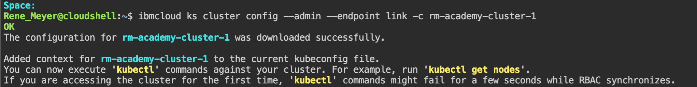
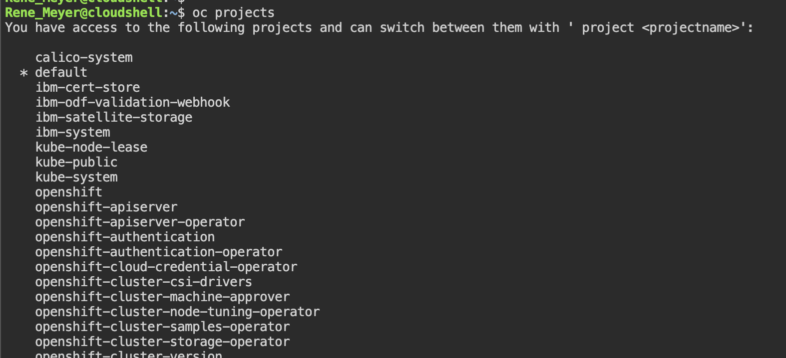

# Access OpenShift using Satellite Link Endpoint with Cloud Shell

1. Open **Cloud Shell** from your IBM Cloud ITZ Account
    

1. A new Browser tab will open enter the following commands to connect to your cluster.

    ```sh
    ibmcloud target -g <resource-group-name>
    ibmcloud ks clusters
    ibmcloud ks cluster config --admin --endpoint link -c <clustername>
    ```

   

    > Cloud Shell is able to reach Satellite Endpoints as CSE in the 166.x.x.x private Address Space of IBM Cloud.

1. Now you could use oc cli

   ```sh
   oc projects
   ```

   

1. You can perform all kubectl/oc CLI functions using this connection method.
