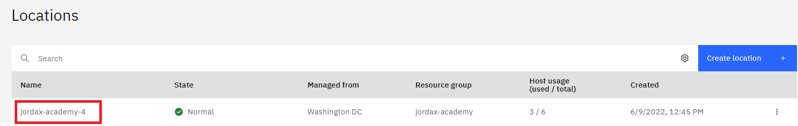
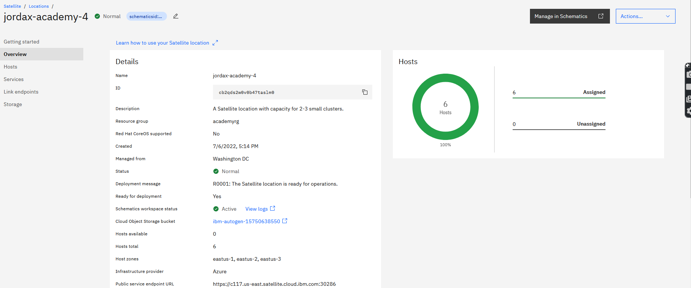
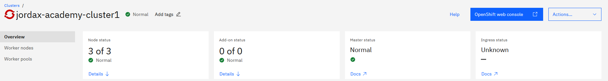

## Lab1 - Check status of your Satellite location and ROKS cluster

- [Lab1 - Check status](#lab1---check-status)
    - [UI](#ui)
    - [CLI](#cli)

### Check status from UI

Go to the left navigation menu, on top left corner to the left of IBM Cloud and the click on Satellite Locations


Click on the location




On the Overview page, you can see status is normal




On left side click on Hosts to show the hosts attached to the location and all hosts in normal


Review Cluster state:




Ingress is Unknown because currently in the cluster displayed the nodes only has private IPs, we will change this later

### Check status using Satellite CLI

Install IBM CLI

https://cloud.ibm.com/docs/cli?topic=cli-install-ibmcloud-cli

```
curl -fsSL https://clis.cloud.ibm.com/install/linux | sh

ibmcloud version
ibmcloud version 1.3.0+4308925-2020-12-16T07:53:49+00:00
```

During login use "--sso" in case you have SSO configured with IBM Cloud, like for example the case of IBM users.

```
ibmcloud login --sso

Select an account:
18. itztsglenablement23 (20c282cbc5174bdbaddb0a5b94025d9f) <-> 2566264
Enter a number> 18

ibmcloud target -r us-east
ibmcloud target -g academyrg
```

Check location status

```
ibmcloud sat location ls
Retrieving locations...
OK
Name               ID                     Status   Ready   Created        Hosts (used/total)   Managed From
jordax-academy-4   cahrvp4w07i0nklqkbpg   normal   yes     20 hours ago   6 / 6                wdc


ibmcloud sat location get --location jordax-academy-4
Retrieving location...
OK

Name:                           jordax-academy-4
ID:                             cahrvp4w07i0nklqkbpg
Created:                        2022-06-10 22:04:20 +0000 (20 hours ago)
Managed From:                   wdc
State:                          normal
Ready for deployments:          yes
Message:                        R0001: The Satellite location is ready for operations.
Hosts Available:                0
Hosts Total:                    6
Host Zones:                     eastus-1, eastus-2, eastus-3
Public Service Endpoint URL:    https://c117.us-east.satellite.cloud.ibm.com:30623
Private Service Endpoint URL:   -
OpenVPN Server Port:            -
```

"R0001: The Satellite location is ready for operations." is the correct message when the location is enabled and ready.

If status indicates warning with an error code, refer to steps needed to fix it as in cloud docs https://cloud.ibm.com/docs/satellite?topic=satellite-ts-locations-debug

Check cluster status:

```
ibmcloud ks cluster ls
OK
Name                      ID                     State    Created        Workers   Location           Version                 Resource Group Name   Provider
jordax-academy-cluster1   cai4c1ew0o3o3vme5fa0   normal   11 hours ago   3         jordax-academy-4   4.9.33_1540_openshift   academyrg             satellite


ibmcloud ks cluster get --cluster jordax-academy-cluster1 | grep Status
Status:                         All Workers Normal
Ingress Status:                 -
Status:     Ready
```
