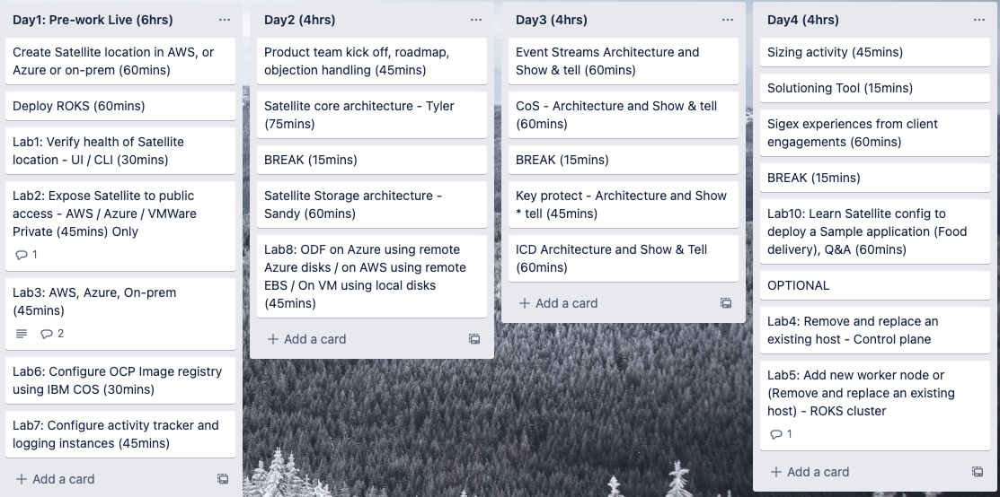

# Satellite Tech Academy 2022 Handbook

## Schedule

1. Satellite Session #1 July 18th - 21st - COMPLETED
1. Satellite Session #2 August 15th - 18th
1. Satellite Session #3 August 29th - Sept 1st

> Format: Classroom
> Location: Raleigh, North Carolina

## Table of Contents

1. [Overview](#overview)
1. [Agenda](#agenda)
1. [Lab environment](#lab-environment)
1. [Student Pre-requisites](#student-pre-requisites)
1. [Readiness for the academy Labs](#readiness-for-the-academy-labs)
1. [Day 1](#day-1)
1. [Day 2](#day-2)
1. [Day 3](#day-3)
1. [Day 4](#day-4)
1. [Get certified](#get-certified)
1. [Lab cleanup](#lab-cleanup)

## Overview

The Cloud Platform SKO Technical Academy teaches the skills needed to

- Develop L4/PoC-level skills on specific topics​
- Solution, Design and Prepare to deliver a Proof of Concept
- Provision and configure solution​ in a complex hybrid cloud environment
- Build customizable use case driven demos

The attendee will begin to gain expert skills which will enable them to handle complex use case scenarios independently. When the attendee successfully completes this class they will be prepared to mentor and help develop less experienced employees in his/her assigned subject area. Three tracks are offered that focus on delivering deep level of training and this handbook is for the **IBM Cloud Satellite** Academy Session.

This is an invitation only event and to qualify to attend, you must complete the following pre-req's and pre-work defined for the track you wish to attend. We also require all IBM employees to have a sign of from
their FLM's to attend.

For more information about [**Technical Academy for Cloud Platform**](https://ibm.seismic.com/Link/Content/DCHhRX6CMCggXGWFGhjVhqB86Phd)

> Note: In this document reference to "participants" or "students" is for those who are nominated to attend the Academy session to gain hands-on experience.

## Agenda

For details of session agenda and labs to be performed by the students during the workshop by day

NOTE: Lab 4 and 5 have been moved to optional for this Session. These labs can be performed on your own at the completion of Day 4.

## Lab environment

Infrastructure required for the lab is provided by IBM Technology Zone, for the students to perform hands-on exercises during the workshop.

Infrastructure provided by TechZone includes IBM cloud account, credentials required to create Satellite locations using AWS, Azure and on-prem infrastructure.

There are two parts to the lab environment, one that is required for the student to use and other for the instructor led scenarios. Please see below diagrams for Students env for those pre-assigned to AWS, Azure or on-prem.

**AWS** Infrastructure environment

**Azure** Infrastructure environment

**VMWare** on-prem Infrastructure environment

> Download source [.drawio](drawio/Satellite%20Academy%20Student%20Lab%20env.drawio) file for the **Student** Lab env.

**Instructor Lab** env with Satellite enabled services deployed in Hybrid cloud using two Satellite locations, one on-prem and other in AWS. On-prem satellite locations is emulated using IBM VPC IaaS, for demo purposes, but it can deployed in customer data centers same way.

> Download source [.drawio](drawio/Satellite%20Academy%20Instructor%20lab%20env.drawio) file for the **Instructor** Lab env.

## Student Pre-requisites

Students are expected to complete pre-requisites in order to be ready for the workshop and take advantage of it.

- Completion of IBM Cloud Satellite enablement L1-L3 -- Tech /Sales
    Enablement learning curriculum
    <https://techzone.ibm.com/collection/ibm-cloud-satellite-level-3>

- Cloud Platform BTS/PTS should invite the IBM Cloud Platform geo
        Tech Leader to cloud account upon completion for review.  Non
        BTS/PTS participants should add <dusij@us.ibm.com> and contact
        Jagan Dusi for review.

- Completion of ICCT "IBM Cloud Satellite Specialty" training plan,
    confirmed by your FLM.  ICCT certification exam does not need to be
    completed prior to academy training, but participants are expected
    to pass certification exam post academy
    <https://yourlearning.ibm.com/activity/PLAN-5E61CE6D0469>

- IBM Cloud Satellite training:
    <https://www.ibm.com/training/path/ibmcloudsatellite>

### Pre-work

Participants are required to complete a pre-work assignment on Day1 of the Academy. Pre-work includes creating a Satellite location which will enable performing all the hands-on lab exercises during the Academy.

TechZone demos that are pre-assigned are available [**here**](https://techzone.ibm.com/collection/cloud-platform-tech-academy-satellite)

### Environments

Please use the following instructions to create your Satellite location depending on your environment:

1. [AWS](aws/aws-prework.md)
1. [Azure](azure/azure-prework.md)
1. [VMWare On-Prem](vmware/vmware-prework.md)

## Readiness for the academy Labs

Students are required to make sure the following pre-work are completed Day 1 of the Academy

1. Confirm you are pre-assigned to use a TechZone demo to use infrastructure either in AWS or Azure or on-prem

1. Make sure a Satellite location is created and is in "Normal" state

1. Deploy Red Hat OpenShift in Satellite location

NOTE: You can not access OpenShift console until you perform necessary labs during the session

As mentioned above, please use the links below to complete the pre-reqs
<https://techzone.ibm.com/collection/cloud-platform-tech-academy-satellite>

> **Support:** If you have any questions or need help during the pre-work, please post them in the [slack channel](https://ibm-cloudplatform.slack.com/archives/C03NE5ASPAM)

Below sections for each Day provide detailed instructions that students will need to perform during the hands-on workshops.

NOTE: Labs may appear to not follow a numerical order as labs have been adjusted due to these Academy sessions being remote.

## Day 1

You will be setting up your Satellite location, installing a Red Hat OpenShift on IBM Cloud cluster and performing the initial labs as pre-work. We will have an initial kickoff session to go over the agenda for the labs and architectural sessions.

- Console and CLIs depending on student's assignments
  - AWS
  - Azure
  - on-prem
- Review status and health of Satellite location created during the pre-work both from IBM Cloud 
- Expose OpenShift Cluster to public access over internet
  - AWS
  - Azure
  - For on-prem it remains private access over VPN and no public access is allowed
- Add additional host to satellite location
- Configure OCP Image registry using IBM CoS
- Configure Activity Tracker and Logging

## Day 1 Labs

| Labs          | AWS           | Azure  | VMWare On-prem  |
| ------------- |:-------------:| ------:| ----------------:|
| Create Satellite Location | | | |
| Install Red Hat OpenShift on IBM Cloud | | | |
| Lab 1: Review status of Satellite location and cluster | [common](common/healthstatus/readme.md) | [common](common/healthstatus/readme.md) | [common](common/healthstatus/readme.md) |
| Lab 2: Expose OpenShift Cluster to public internet | [link](aws/aws-access-roks-inet.md) | [link](azure/AcademyLabs.md#lab2---expose-roks) | N/A (Private Only) |
| Lab 3: Add new host to Satellite location | [link](aws/aws-add-hosts.md)      |   [link](azure/AcademyLabs.md#lab-3---add-new-hosts-to-the-location) |  [link](vmware/vmware-add-hosts.md) |
| Lab 6: Configure OCP Image registry using IBM CoS | [common](common/cos-image-registry/readme.md) | [common](common/cos-image-registry/readme.md) | [common](common/cos-image-registry/readme.md) |
| Lab 7: Configure activity tracker and logging instances (Optional) | [common](common/observability/readme.md) | [common](common/observability/readme.md) | N/A |

## Day 2

Day 2, 3 and 4 includes architectural session and hands-on workshops performed by the students.

Here is the overview of what students are expected to learn in sessions and by performing hands-on exercises on this day:

- Satellite core architecture
- Satellite storage architecture
- Configure Satellite storage template using Red Hat OpenShift Data Foundation (ODF) (formerly known as Openshift Container Storage OCS). Labs included are to deploy ODF with remote disks as well as local disks.

| Labs          | AWS           | Azure  | VMWare On-prem  |
| ------------- |:-------------:| ------:| ----------------:|
| Lab 8 : Configure ODF | [link](aws/aws-odf-ebs.md) | [link](azure/azure-odf.md) | [link](vmware/wmware-odf.md) |

## Day 3

Here is the overview of what students are expected to learn in sessions and by performing hands-on exercises on this day:

- Event Streams on Satellite architecture
- Cloud Object Storage on Satellite architecture
- Key Protect on Satellite architecture
- IBM Cloud Databases on Satellite architectures
- Create Satellite Link endpoint and test them to access resources in the cloud or in the location.

- Watch how to troubleshoot and debug Satellite related issues.

| Labs          | AWS           | Azure  | VMWare On-prem  |
| ------------- |:-------------:| ------:| ----------------:|
| Lab 9: Configure Link Endpoints | [common](link/satellite-link-config-lab.md) | [common](link/satellite-link-config-lab.md) | [common](link/satellite-link-config-lab.md) |

## Day 4

Here is the overview of what students are expected to learn in sessions and by performing hands-on exercises on this day:

- Perform common troubleshooting scenarios
- Perform Satellite location troubleshooting
- Installation of the Food Delivery App with a variation of connecting to a Mongo instance residing in the public IBM Cloud. Credentials for the IBM Cloud Mongo instance will be provided if you do not have your own instance in your test account.
- Add two new hosts to Satellite location
  - To AWS location using AWS CLI
  - To Azure location using Azure CLI
  - For on-prem when you requested TechZone reservation, two additional hosts should have been pre-provisioned but not attached to the Satellite location
  - Connect over VPN to vcenter to check two spare hosts
- Remove or replace an existing host for Satellite control plane
- Add new worker ndoes to the OpenShift cluster

| Labs          | AWS           | Azure  | VMWare On-prem  |
| ------------- |:-------------:| ------:| ----------------:|
| Lab 10: Deploy Food Delivery App using Satellite config | [Github Repo](https://github.com/mcltn/food-delivery-satellite-lab) | [Github Repo](https://github.com/mcltn/food-delivery-satellite-lab) | [Github Repo](https://github.com/mcltn/food-delivery-satellite-lab) |
| OPTIONAL | | | |
| Lab 4: Remove and replace an existing host - Control plane | [common](common/assign-hosts/readme.md#replace-control-plane) | [common](common/assign-hosts/readme.md#replace-control-plane) | [common](common/assign-hosts/readme.md#replace-control-plane) |
| Lab 5: Add new worker node or (Remove and replace an existing host) | [common](common/assign-hosts/readme.md#add-new-worker-to-roks) | [common](common/assign-hosts/readme.md#add-new-worker-to-roks) | [common](common/assign-hosts/readme.md#add-new-worker-to-roks) |
| | | | |
| | | | |

## Q&A with Product management team

Please engage with Product management team and clarify your questions or customer objections to be able to differentiate IBM Cloud Satellite against competition with good value proposition.

### Instructor led Satellite services labs

- Learn from Instructor led session to understand capabilities of each Satellite enabled service as below and on how to deploy Satellite them  onto Satellite location
  - ICD
  - KP
  - CoS
  - Event Streams

- Experience working with Satellite enabled services with hands-on labs
  - ICD
  - KP
  - CoS
  - Event Streams

### Satellite for FS and SCC

- [Show and tell of techzone demo](https://techzone.ibm.com/collection/SatelliteForFSControls)

### Lab 11: How to use Activity Tracker, Logging and Monitoring

- This is an instructor led lab activity where you will see how to use observeability.

- Using **Activity Tracker** to track events by toggling Link endpoint. Click [**here**](instructor-labs/activity-tracker-lab/steps.md)

- Using **Monitoring** to see monitoring in action for Health of Satellite location. Click [**here**](instructor-labs/infrastructure-monitor-lab/steps.md)

### Lab12: Instructor Lab - Perform troubleshooting, debugging and RCA

- This is an instructor led lab activity where you will see how to use observability

### Lab 13: KP hands-on experience

### Lab 14: CoS hands-on experience

### Lab 15: Event Streams hands-on experience

- Link to the [lab](instructor-labs/event-streams-lab/event-streams-satellite-lab.md)

## Get certified

Here is the certification overview, objectives, exam preparation and registration for [Cloud Satellite v1 Specialty](https://www.ibm.com/training/certification/S0010800).

## Lab cleanup

This needs to be completed within 72 hours after completing the academy session. [Cleanup instructions](common/cleanup/readme.md)
