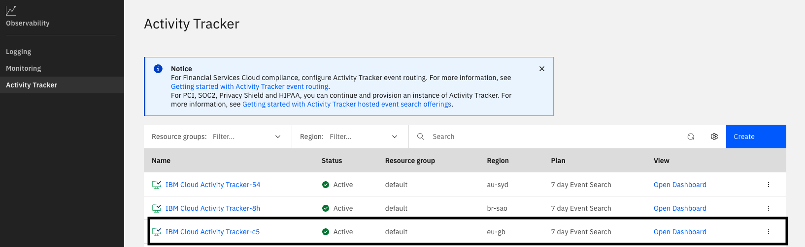
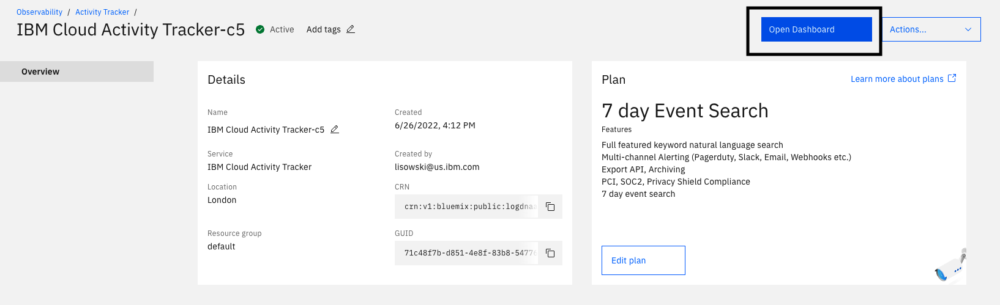
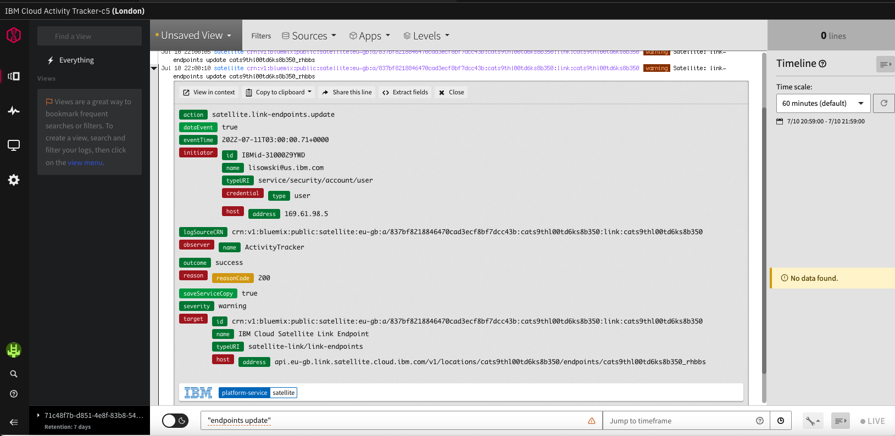
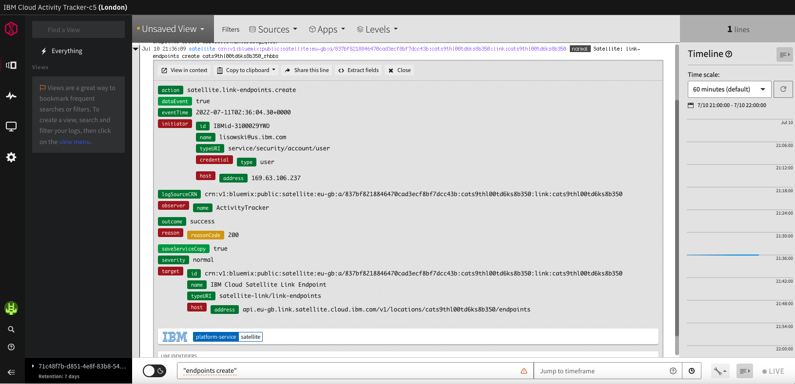
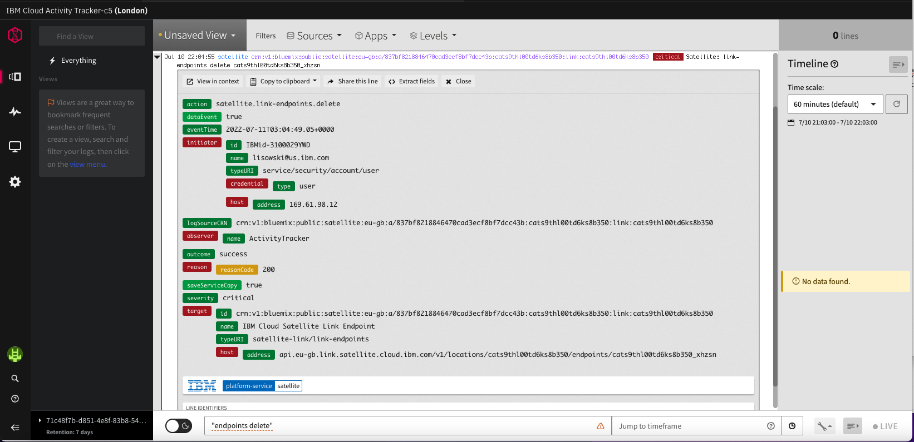

## Activity Tracker Logs for Satellite

In this lab: we will view the activity tracker events associated with link endpoint operations. 

### Lab Steps

1. Go to appropriate Activity Tracker instance for region. [Relevant link](https://cloud.ibm.com/observe/activitytracker).
   
   

2. Toggle link endpoints on and off in the Link Endpoints page of a given location. In the activity tracker logs search for `"endpoints update"` to see the data on the corresponding event.
   

3. Create and endpoint in the Link Endpoints page of a given location. In the activity tracker logs search for `endpoints create` to see the data on the corresponding event.
   

4. Delete an endpoint in the Link Endpoints page of a given location. In the activity tracker logs search for `endpoints delete` to see the data on the corresponding event.
   

Congrats! The lab is now complete.

Authors: Tyler Lisowski