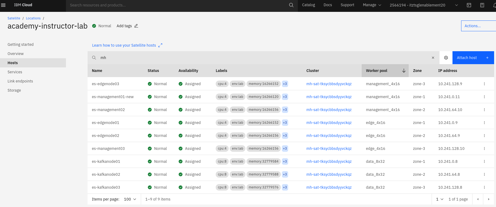
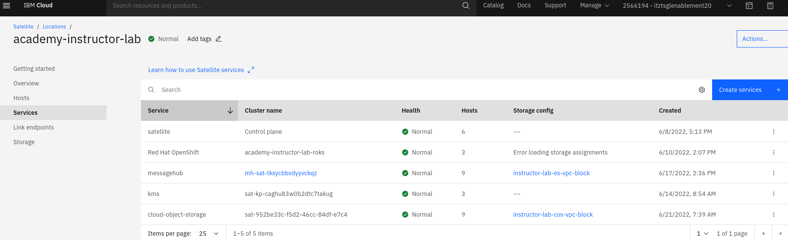
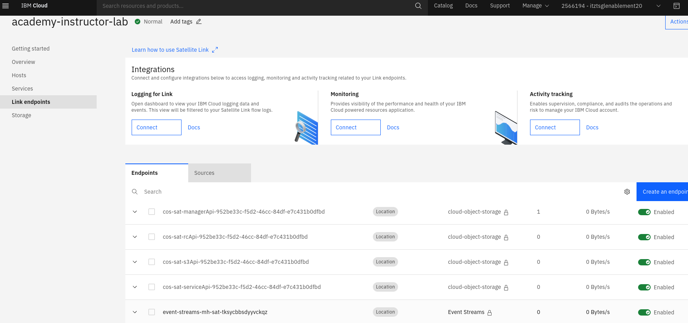
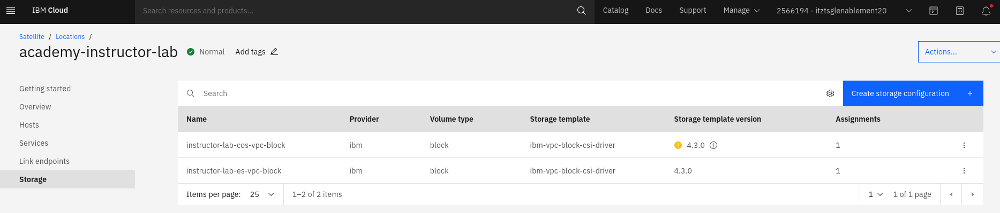
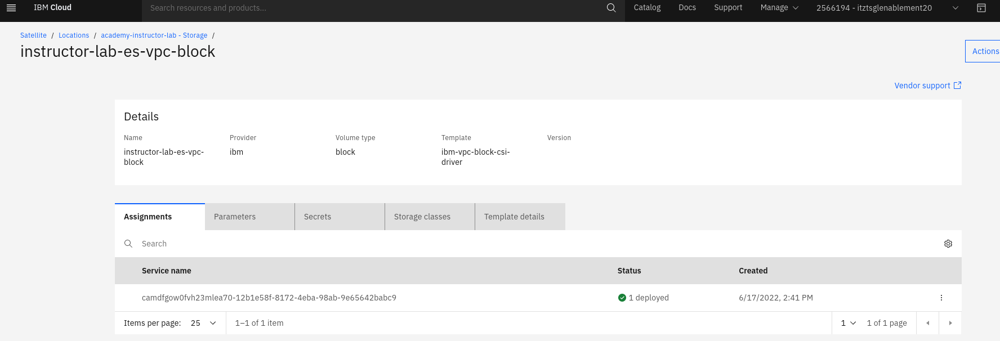
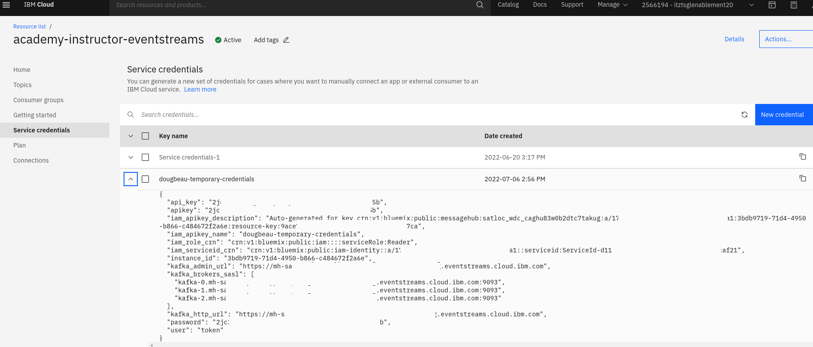
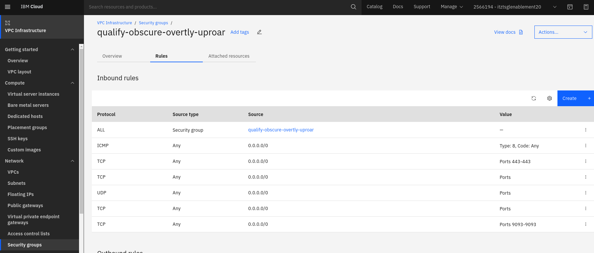
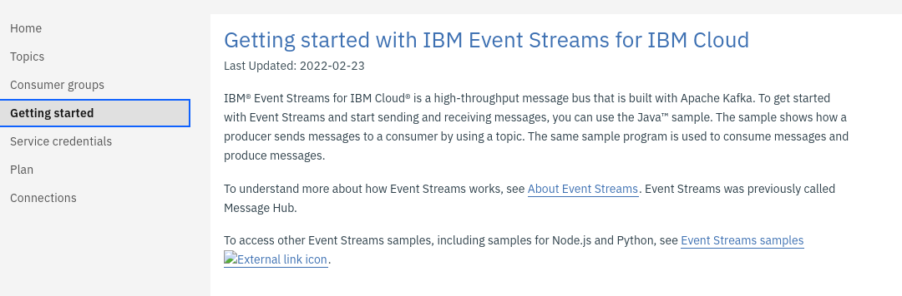

# IBM® Event Streams for IBM Cloud® - IBM Cloud Satellite® plan

## Introduction
IBM Event Streams for IBM Cloud is a high-throughput message bus that is built with Apache Kafka.

To get started with Event Streams and start sending and receiving messages, you can use the Java™ sample.  This lab will walk through deploying the sample program and running it using a preprovisioned Event Streams service instance.

The sample program shows how a producer sends messages to a consumer by using a topic. The same sample program is used to consume messages and produce messages.  See the [References](#reference-information--links) section for additional information on the sample program.

The lab will also explore using the Event Streams REST API and ibmcloud CLI plugin.  An instance of IBM Cloud Monitoring has also been provisioned that will allow you to see the sample programs activity

In the sections below...
- Review the single instance of Event Streams deployed to a Satellite location used by all students
- You will SSH into a virtual server instance running in the same virtual private cloud as the Satellite location/Event Streams deployment
- The required tools for building the sample program will be installed on your virtual server instance
- You will build the sample program in your virtual server instance
- Using two virtual server instance sessions...
  - one session will produce messages to a unique topic in the Event Streams instance
  - the other session will consume messages from that topic
- You will use the Event Streams REST API to retrieve a list of topics
- You will install and run the Event Streams `ibmcloud es` CLI plugin
- You can see the sample program's activity in Monitoring
- Optionally update the sample program to send more data and/or use a different default topic


## Review deployed environment

1. Resource list
   | Type | Name | Location |
   | --- | --- | --- |
   | Satellite | `academy-instructor-lab` | Washington DC |
   | Services... | `academy-instructor-eventstreams` | academy-instructor-lab |

   
1. Event Streams service instance specifics in the satellite location
   - Hosts
     | Item | Value | Description |
     | --- | --- | --- |
     | Cluster | `mh-sat-....` | ROKS cluster behind the service instance, the cluster is in the Event Streams service account |
     | Worker pool | `edge, management, data` | 3 Worker pools created during Event Streams provision |

     
   - Services
     | Item | Value | Description |
     | --- | --- | --- |
     | Service | `messagehub` | architected name of the Event Streams service, `Event Streams` used be `MessageHub` |
     | Cluster name | `mh-sat-...` | ROKS cluster behind the service instance, the cluster is in the Event Streams service account |
     | Storage config | `instructor-lab-es-vpc-block` | ustomer created VPC storage config in the sat location that Event Streams will use to provision required block storage |

     
   - Link endpoints
     | Item | Value | Description |
     | --- | --- | --- |
     | Endpoints | `event-streams-mh-sat-tksycbbsdyyvckqz` | Sat location endpoint created by the Event Streams provision process, enables access for the CLI plug-in and REST API |

     
   - Storage - **Configuration**
     | Item | Value | Description |
     | --- | --- | --- |
     | Name | `instructor-lab-es-vpc-block` | Satellite storage configuration for Event Streams |
     | Storage template | `ibm-vpc-block-csi-driver` | (Beta) VPC block storage configured to use VPC block from the 2566194 - itztsglenablement20 account |
     | Storage template version | `4.3.0` | It is actually running fix version 4.3.2, fix coming to display the fix version correctly |

     
   - Storage - **Assignment**

     - Clicking on the **instructor-lab-es-vpc-block** storage configuration above displays any service assignments using that configuration
     - The **Service name** shown below is not very user friendly

       
     - Getting the list of services and assignments we can correlate the storage assignment name back to the Event Streams service
       ```
       Get the list of Event Stream services in the sat location
     
       $ ibmcloud sat services --location caghu83w0b2dtc7takug | grep messagehub
       mh-sat-tksycbbsdyyvckqz            camdfgow0fvh23mlea70   messagehub             All Workers Normal   3 weeks ago   9       no   


       Using the ID of the Event Streams service, get it's storage assignment, we see the name of the assignment is what we see in the console

       $ ibmcloud sat storage assignment ls | grep camdfgow0fvh23mlea70
       camdfgow0fvh23mlea70-12b1e58f-8172-4eba-98ab-9e65642babc9   c119536a-606a-42ee-aeda-46f619c50e81   -                camdfgow0fvh23mlea70   instructor-lab-es-vpc-block           instructor-lab-es-vpc-block_v02           ServiceSubscription   2022-06-17T19:41:13.816Z 
       ```
1. Event Streams service instance Service credentials

   Later in the lab, we will use elements of the service credentials for the sample program and REST API.  Actual values will be provided to you.
   | Item | Description |
   | --- | --- |
   | apikey | API Key used to authorize access |
   | kafka_brokers_sasl | List of kafka brokers in the Event Streams cluster the sample program will use to send/receive messages |
   | kafka_http_url | URL used for the Event Streams REST API |

   **Note**:  `dougbeau-temporary-credentials` below was temporarily created for the screenshot example only, the credential has been deleted
   
1. VPC Infrastructure security group

   The security group assigned to the Event Streams cluster VPC instances needs inbound ports enabled/disabled
   | Action | Protocol | Port range | Source type | Description |
   | --- | --- | --- | --- | --- |
   | Enabled | TCP | 9093 - 9093 | Any | Kafka brokers listen on port 9093 |
   | Enabled | TCP | 443 - 443 | Any | Kafka admin/http listen on port 443 |
   | **Disabled** | TCP | 22 - 22 | Any | SSH access |

   We disable (remove) any inbound rule for port 22 so no SSH connection/login attempts can be made to the Event Streams hosts.  The security tooling will detect these attempts, IBM Security Operations Center will be notified, SOC will page Event Streams operations support to investigate.  It should also be noted that ROKS disables the root SSH user on the cluster.

   


## Set up tools for building the Event Streams sample program
Use the steps below to set up the tools needed to build the sample program.  The setup will occur on a virtual server running in the same virtual private cloud as the Event Streams satellite deployment.

1. Open a terminal session
1. SSH into your virtual server

   `ssh -i privatekey root@xxx.xxx.xxx.xxx`
1. Run the following commands to install git and java
   1. `sudo apt-get install git`
   1. `sudo apt-get install openjdk-8-jdk`
   1. `sudo apt-get install unzip`
1. Run the following commands to download, set up, and verify gradle per instrucions at https://gradle.org/install/
   1. `wget https://services.gradle.org/distributions/gradle-7.4.2-bin.zip`
   1. `mkdir /opt/gradle`
   1. `unzip -d /opt/gradle gradle-7.4.2-bin.zip`
   1. `ls -la /opt/gradle/gradle-7.4.2`
      ```
      total 44
      drwxr-xr-x. 5 root root    85 Feb  1  1980 .
      drwx------. 3 root root    26 Jul  9 18:36 ..
      drwxr-xr-x. 2 root root    38 Feb  1  1980 bin
      drwxr-xr-x. 2 root root    24 Feb  1  1980 init.d
      drwxr-xr-x. 3 root root  8192 Feb  1  1980 lib
      -rw-r--r--. 1 root root 23606 Feb  1  1980 LICENSE
      -rw-r--r--. 1 root root   868 Feb  1  1980 NOTICE
      -rw-r--r--. 1 root root   976 Feb  1  1980 README
      ```
   1. `export PATH=$PATH:/opt/gradle/gradle-7.4.2/bin`
   1. `gradle -version`
      ```
      ------------------------------------------------------------
      Gradle 7.4.2
      ------------------------------------------------------------

      Build time:   2022-03-31 15:25:29 UTC
      Revision:     540473b8118064efcc264694cbcaa4b677f61041

      Kotlin:       1.5.31
      Groovy:       3.0.9
      Ant:          Apache Ant(TM) version 1.10.11 compiled on July 10 2021
      JVM:          1.8.0_332 (Red Hat, Inc. 25.332-b09)
      OS:           Linux 3.10.0-1160.53.1.el7.x86_64 amd64
      ```

## Build the sample program
Use the steps below to download the sample program and build it on the virtual server.

1. Open a terminal session
1. SSH into your virtual server

   `ssh -i privatekey root@xxx.xxx.xxx.xxx`
1. Build sample program
   1. `cd /`
   1. `git clone https://github.com/ibm-messaging/event-streams-samples.git`
   1. `cd /event-streams-samples/kafka-java-console-sample`
   1. `ls -la`
      ```
      total 44
      drwx------.  4 root root  198 Jul  9 18:39 .
      drwx------. 12 root root 4096 Jul  9 18:39 ..
      -rw-------.  1 root root 1578 Jul  9 18:39 build.gradle
      -rw-------.  1 root root  328 Jul  9 18:39 Dockerfile
      drwx------.  2 root root  136 Jul  9 18:39 docs
      -rw-------.  1 root root   38 Jul  9 18:39 .gitignore
      -rw-------.  1 root root  351 Jul  9 18:39 kafka-java-console-sample.yaml
      -rw-------.  1 root root 9159 Jul  9 18:39 LICENSE
      -rw-------.  1 root root  300 Jul  9 18:39 manifest.yml
      -rw-------.  1 root root 1108 Jul  9 18:39 README.md
      -rw-------.  1 root root   47 Jul  9 18:39 settings.gradle
      drwx------.  3 root root   18 Jul  9 18:39 src
      ```
   1. `gradle clean`
      ```
      Starting a Gradle Daemon (subsequent builds will be faster)

      BUILD SUCCESSFUL in 8s
      1 actionable task: 1 up-to-date
      ```
   1. `gradle build`
      ```
      BUILD SUCCESSFUL in 24s
      6 actionable tasks: 6 executed
      ```

## Start the sample program
The Event Stream kafka java console sample program is a single program that can produce and consume message data through and instance of Event Streams.

The steps below will have you use two terminal sessions...one session will produce message data, the other session will consume the message data.

1. The sample program communicates via port **9093** to the kafka brokers in the Event Stream instance.  We reviewed above the ports that need inbound access within the VPC Security Group in **4. VPC Infrastructure security group** of [Review deployed environment](#review-deployed-environment)
1. Open two terminal sessions
1. SSH into your virtual server in both terminal sessions

   `ssh -i privatekey root@xxx.xxx.xxx.xxx`
1. Start the consumer program
   1. Select one of the terminal sessions and run the following commands
   1. `cd /event-streams-samples/kafka-java-console-sample`
   1. `java -jar ./build/libs/kafka-java-console-sample-2.0.jar kafka-2.mh-sat-tksycbbsdyyvckqz.caghu83w0b2dtc7takug.eventstreams.cloud.ibm.com:9093,kafka-1.mh-sat-tksycbbsdyyvckqz.caghu83w0b2dtc7takug.eventstreams.cloud.ibm.com:9093,kafka-0.mh-sat-tksycbbsdyyvckqz.caghu83w0b2dtc7takug.eventstreams.cloud.ibm.com:9093 xxxxxxxxxxxxxxxx -topic student-topic-name -consumer`
      - **kafka-2.mh-sat-tksycbbsdyyvckqz...** is the comma separated list of kafka brokers in the Service credentials "kafka_brokers_sasl"
      - **xxxxxxxxxx** is the API Key value in the Service credentials "apikey"
      - **student-topic-name** is a unique name for your message data that will be created in the Event Streams instance, use something unique to you

      The consumer is ready and running when you see output similar to
      ```
      [2022-07-09 18:48:30,124] INFO No messages consumed (com.eventstreams.samples.ConsumerRunnable)
      [2022-07-09 18:48:33,125] INFO No messages consumed (com.eventstreams.samples.ConsumerRunnable)
      [2022-07-09 18:48:36,126] INFO No messages consumed (com.eventstreams.samples.ConsumerRunnable)
      ```
1. Start the producer program
   1. Select one of the terminal sessions and run the following commands
   1. `cd /event-streams-samples/kafka-java-console-sample`
   1. `java -jar ./build/libs/kafka-java-console-sample-2.0.jar kafka-2.mh-sat-tksycbbsdyyvckqz.caghu83w0b2dtc7takug.eventstreams.cloud.ibm.com:9093,kafka-1.mh-sat-tksycbbsdyyvckqz.caghu83w0b2dtc7takug.eventstreams.cloud.ibm.com:9093,kafka-0.mh-sat-tksycbbsdyyvckqz.caghu83w0b2dtc7takug.eventstreams.cloud.ibm.com:9093 xxxxxxxxxxxxxxxx -topic student-topic-name -producer`
      - **kafka-2.mh-sat-xtpgnbtywyksbrpp...** is the comma separated list of kafka brokers in the Service credentials "kafka_brokers_sasl"
      - **xxxxxxxxxx** is the API Key value in the Service credentials "apikey"
      - **student-topic-name** is a unique name for your message data that will be created in the Event Streams instance, use something unique to you

      The producer is ready and running when you see output similar to
      ```
      [2022-07-09 18:50:55,049] INFO class com.eventstreams.samples.ProducerRunnable is starting. (com.eventstreams.samples.ProducerRunnable)
      [2022-07-09 18:50:55,384] INFO Message produced, offset: 0 (com.eventstreams.samples.ProducerRunnable)
      [2022-07-09 18:50:57,399] INFO Message produced, offset: 1 (com.eventstreams.samples.ProducerRunnable)
      [2022-07-09 18:50:59,415] INFO Message produced, offset: 2 (com.eventstreams.samples.ProducerRunnable)
      ```
1. While the producer loops sending message data, you should see the consumer now looping receiving the message data
   ```
   [2022-07-09 18:50:54,163] INFO No messages consumed (com.eventstreams.samples.ConsumerRunnable)
   [2022-07-09 18:50:55,395] INFO Message consumed: ConsumerRecord(topic = student-topic-name, partition = 0, leaderEpoch = 0, offset = 0, CreateTime = 1657392655051, serialized key size = 3, serialized value size = 57, headers = RecordHeaders(headers = [], isReadOnly = false), key = key, value = {"message":"This is a test message #","message_number":0}) (com.eventstreams.samples.ConsumerRunnable)
   [2022-07-09 18:50:57,414] INFO Message consumed: ConsumerRecord(topic = student-topic-name, partition = 0, leaderEpoch = 0, offset = 1, CreateTime = 1657392657384, serialized key size = 3, serialized value size = 57, headers = RecordHeaders(headers = [], isReadOnly = false), key = key, value = {"message":"This is a test message #","message_number":1}) (com.eventstreams.samples.ConsumerRunnable)
   [2022-07-09 18:50:59,415] INFO Message consumed: ConsumerRecord(topic = student-topic-name, partition = 0, leaderEpoch = 0, offset = 2, CreateTime = 1657392659400, serialized key size = 3, serialized value size = 57, headers = RecordHeaders(headers = [], isReadOnly = false), key = key, value = {"message":"This is a test message #","message_number":2}) (com.eventstreams.samples.ConsumerRunnable)
   ```
1. Let them keep running for a while

## Using the Event Streams REST API
Event Streams provides an Administration RESTful API that you can use to create, delete, list, and update topics.

The steps below will show you how to use the API to get the list of topics in the Event Streams instance

1. The API communicates via port **443** into the admin component of the Event Stream instance.  We reviewed above the ports that need inbound access within the VPC Security Group in **4. VPC Infrastructure security group** of [Review deployed environment](#review-deployed-environment)
1. Open a new terminal session
1. SSH into your virtual server

   `ssh -i privatekey root@xxx.xxx.xxx.xxx`
1. `curl -i -X GET -H 'Accept: application/json' -H 'Content-Type: application/json' -u token:xxxxxxxxxxxxxxxx https://mh-sat-tksycbbsdyyvckqz.caghu83w0b2dtc7takug.eventstreams.cloud.ibm.com/admin/topics`
   
   - **xxxxxxxxxx** is the API Key value in the Service credentials "apikey"
   - **https://mh-sat-tksycbbsdyyvckqz.....** is the URL in the Service credentials "kafka_http_url"

   - The output will be similar to
     ```
     [{"name":"__consumer_offsets","partitions":50,"replicationFactor":3,"retentionMs":86400000,"cleanupPolicy":"compact","configs":{"cleanup.policy":"compact","min.insync.replicas":"2","retention.bytes":"1073741824","retention.ms":"86400000","segment.bytes":"104857600"},"replicaAssignments":[{"id":13,"brokers":{"replicas":[1,2,0]}},{"id":25,"brokers":{"replicas":[1,2,0]}},{"id":26,"brokers":{"replicas":[2,0,1]}},{"id":37,"brokers":{"replicas":[1,2,0]}},{"id":38,"brokers":{"replicas":[2,0,1]}},{"id":40,"brokers":{"replicas":[1,0,2]}},{"id":11,"brokers":{"replicas":[2,1,0]}},{"id":31,"brokers":{"replicas":[1,2,0]}},{"id":18,"brokers":{"replicas":[0,1,2]}},{"id":29,"brokers":{"replicas":[2,1,0]}},{"id":48,"brokers":{"replicas":[0,1,2]}},{"id":23,"brokers":{"replicas":[2,1,0]}},{"id":12,"brokers":{"replicas":[0,1,2]}},{"id":30,"brokers":{"replicas":[0,1,2]}},{"id":14,"brokers":{"replicas":[2,0,1]}},{"id":19,"brokers":{"replicas":[1,2,0]}},{"id":32,"brokers":{"replicas":[2,0,1]}},{"id":43,"brokers":{"replicas":[1,2,0]}},{"id":5,"brokers":{"replicas":[2,1,0]}},{"id":15,"brokers":{"replicas":[0,2,1]}},{"id":35,"brokers":{"replicas":[2,1,0]}},{"id":16,"brokers":{"replicas":[1,0,2]}},{"id":2,"brokers":{"replicas":[2,0,1]}},{"id":39,"brokers":{"replicas":[0,2,1]}},{"id":4,"brokers":{"replicas":[1,0,2]}},{"id":45,"brokers":{"replicas":[0,2,1]}},{"id":3,"brokers":{"replicas":[0,2,1]}},{"id":28,"brokers":{"replicas":[1,0,2]}},{"id":34,"brokers":{"replicas":[1,0,2]}},{"id":44,"brokers":{"replicas":[2,0,1]}},{"id":33,"brokers":{"replicas":[0,2,1]}},{"id":10,"brokers":{"replicas":[1,0,2]}},{"id":1,"brokers":{"replicas":[1,2,0]}},{"id":41,"brokers":{"replicas":[2,1,0]}},{"id":7,"brokers":{"replicas":[1,2,0]}},{"id":21,"brokers":{"replicas":[0,2,1]}},{"id":22,"brokers":{"replicas":[1,0,2]}},{"id":8,"brokers":{"replicas":[2,0,1]}},{"id":46,"brokers":{"replicas":[1,0,2]}},{"id":47,"brokers":{"replicas":[2,1,0]}},{"id":49,"brokers":{"replicas":[1,2,0]}},{"id":0,"brokers":{"replicas":[0,1,2]}},{"id":9,"brokers":{"replicas":[0,2,1]}},{"id":6,"brokers":{"replicas":[0,1,2]}},{"id":27,"brokers":{"replicas":[0,2,1]}},{"id":36,"brokers":{"replicas":[0,1,2]}},{"id":17,"brokers":{"replicas":[2,1,0]}},{"id":24,"brokers":{"replicas":[0,1,2]}},{"id":42,"brokers":{"replicas":[0,1,2]}},{"id":20,"brokers":{"replicas":[2,0,1]}}]},
     
     {"name":"dougbeau-new-topic","partitions":1,"replicationFactor":3,"retentionMs":86400000,"cleanupPolicy":"delete","configs":{"cleanup.policy":"delete","min.insync.replicas":"2","retention.bytes":"1073741824","retention.ms":"86400000","segment.bytes":"536870912"},"replicaAssignments":[{"id":0,"brokers":{"replicas":[1,2,0]}}]},
     
     {"name":"kafka-java-console-sample-topic","partitions":1,"replicationFactor":3,"retentionMs":86400000,"cleanupPolicy":"delete","configs":{"cleanup.policy":"delete","min.insync.replicas":"2","retention.bytes":"1073741824","retention.ms":"86400000","segment.bytes":"536870912"},"replicaAssignments":[{"id":0,"brokers":{"replicas":[2,1,0]}}]},
     
     {"name":"student-topic-name","partitions":1,"replicationFactor":3,"retentionMs":86400000,"cleanupPolicy":"delete","configs":{"cleanup.policy":"delete","min.insync.replicas":"2","retention.bytes":"1073741824","retention.ms":"86400000","segment.bytes":"536870912"},"replicaAssignments":[{"id":0,"brokers":{"replicas":[0,1,2]}}]}]
     ```
1. The details for using the API and other examples are available at

   [Using the Administration REST API](https://cloud.ibm.com/docs/EventStreams?topic=EventStreams-admin_api)

## Using the Event Streams ibmcloud CLI plug-in
Event Streams provides a plug-in for the **ibmcloud** CLI.  The plugin allows you to work with the kafka brokers, topics partitions, and consumer groups

1. Open a terminal session
1. SSH into your virtual server

   `ssh -i privatekey root@xxx.xxx.xxx.xxx`
1. Install the **ibmcloud** CLI

   `curl -fsSL https://clis.cloud.ibm.com/install/linux | sh`
1. Install the plug-in

   `ibmcloud plugin install event-streams`
1. Login to IBM Cloud

   `ibmcloud login -a cloud.ibm.com --sso`

   - Select account: **itztsglenablement20 (17bf6dc6cf59464780a356f5ae6f49a1) <-> 2566194**
   - Select region: **us-east**
1. Get name of the Event Streams instance.  We want the instance that is deployed to the satellite location

   `ibmcloud resource service-instances`

   The output will be similar to
   ```
   Name:      academy-instructor-eventstreams
   Location:  satloc_wdc_caghu83w0b2dtc7takug
   ```
1. Initialize the plug-in to the Event Streams instance deployed to satellite

   `ibmcloud es init --instance-name academy-instructor-eventstreams`

   The output will be similar to
   ```
   API Endpoint:		https://caghu83w0b2dtc7takug-ugjki.private.us-east.link.satellite.cloud.ibm.com
   Service endpoints:	public
   Sorage size:		2048 GB
   Throughput:		   150 MB/s
   ```
1. Get a list of the topics in the Event Streams instance

   `ibmcloud es topics`

   The output will be similar to
   ```    
   Topic name   
   __consumer_offsets   
   kafka-java-console-sample-topic   
   student-topic-name   
   ```
1. Display the details of a kafka broker

   `ibmcloud es broker 0`

   The output will be similar to
   ```    
   Details for broker
   ID   Host                                                                              Port   Rack   
   0    kafka-0.mh-sat-tksycbbsdyyvckqz.caghu83w0b2dtc7takug.eventstreams.cloud.ibm.com   9093   us-east-2   

   Details for broker configuration
   Name                   Value                                                                                                  Sensitive?   
   broker.id              0                                                                                                      false   
   broker.rack            us-east-2                                                                                              false   
   advertised.listeners   SASL_EXTERNAL://kafka-0.mh-sat-tksycbbsdyyvckqz.caghu83w0b2dtc7takug.eventstreams.cloud.ibm.com:9093   false  
   ```

   Run it again with --json

   `ibmcloud es broker 0 --json`

   The output will be similar to
   ```    
   {"host":"kafka-0.mh-sat-tksycbbsdyyvckqz.caghu83w0b2dtc7takug.eventstreams.cloud.ibm.com","port":9093,"id":0,"rack":"us-east-2","configs":[{"name":"broker.id","value":"0"},{"name":"broker.rack","value":"us-east-2"},{"name":"advertised.listeners","value":"SASL_EXTERNAL://kafka-0.mh-sat-tksycbbsdyyvckqz.caghu83w0b2dtc7takug.eventstreams.cloud.ibm.com:9093"}]}
   ```
1. Display the details of the cluster

   `ibmcloud es cluster`

   The output will be similar to
   ```    
   Details for cluster
   Cluster ID                Controller   
   mh-sat-tksycbbsdyyvckqz   1   

   Details for brokers
   ID   Host                                                                              Port   Rack   
   0    kafka-0.mh-sat-tksycbbsdyyvckqz.caghu83w0b2dtc7takug.eventstreams.cloud.ibm.com   9093   us-east-2   
   2    kafka-2.mh-sat-tksycbbsdyyvckqz.caghu83w0b2dtc7takug.eventstreams.cloud.ibm.com   9093   us-east-3   
   1    kafka-1.mh-sat-tksycbbsdyyvckqz.caghu83w0b2dtc7takug.eventstreams.cloud.ibm.com   9093   us-east-1   
   No cluster-wide dynamic configurations found.
   ```

   Run it again with --json

   `ibmcloud es cluster --json`

   The output will be similar to
   ```    
   {"id":"mh-sat-tksycbbsdyyvckqz","controller":{"host":"kafka-1.mh-sat-tksycbbsdyyvckqz.caghu83w0b2dtc7takug.eventstreams.cloud.ibm.com","port":9093,"id":1,"rack":"us-east-1"},"brokers":[{"host":"kafka-0.mh-sat-tksycbbsdyyvckqz.caghu83w0b2dtc7takug.eventstreams.cloud.ibm.com","port":9093,"id":0,"rack":"us-east-2"},{"host":"kafka-2.mh-sat-tksycbbsdyyvckqz.caghu83w0b2dtc7takug.eventstreams.cloud.ibm.com","port":9093,"id":2,"rack":"us-east-3"},{"host":"kafka-1.mh-sat-tksycbbsdyyvckqz.caghu83w0b2dtc7takug.eventstreams.cloud.ibm.com","port":9093,"id":1,"rack":"us-east-1"}]}

   ```

1. The details for using the CLI are available at

   [Event Streams CLI reference](https://cloud.ibm.com/docs/EventStreams?topic=EventStreams-cli_reference)

## Using monitoring to see activity created by sample application
IBM Cloud® Monitoring is a third-party cloud-native, and container-intelligence management system that you can include as part of your IBM Cloud architecture. 

Use it to gain operational visibility into the performance and health of your applications, services, and platforms. It offers administrators, DevOps teams, and developers full stack telemetry with advanced features to monitor and troubleshoot, define alerts, and design custom dashboards.

- Event Streams metrics can broadly be categorized into two different groups: Default and Enhanced.
- You can configure 1 instance only of the IBM Cloud Monitoring service per region to collect platform metrics in that location.
- Platform metrics are metrics that are exposed by enabled-monitoring services and the platform in IBM Cloud.
To monitor platform metrics for a service instance, provision the IBM Cloud Monitoring instance in the same region where the IBM Cloud service instance that you want to monitor is provisioned.

See [Monitoring Event Streams metrics using IBM Cloud Monitoring](https://cloud.ibm.com/docs/EventStreams?topic=EventStreams-metrics) for details regarding...
- Enabling platform metrics
- Enabling default/enhanced Event Streams metrics
- Metrics cost information
- Event Streams metric details

There is no lab exercise.  The instructor will do a quick demo of the Event Streams dashboards in an instance of IBM Cloud Monitoring.

## Optional:  Update the sample app's default message data / topic name
This optional exercise walks you through making changes to the sample program.

The two changes described below show you how to 
- change the message data that is sent
- change the name of the default topic that is created by the sample program.

For example you might want to change the message data text or the size of the message.  When the program was started in the earlier steps, we used the **-topic** parameter to use a topic unique to you.  When **-topic** is not specified, the program will use a default topic.


1. To edit and rebuild the sample program, use these steps 
   1. Open a terminal session
   1. SSH into your virtual server

      `ssh -i privatekey root@xxx.xxx.xxx.xxx`
   1. `vim <<path/xxx.java>>`  ...the path/xxx.java can be found below, make/save changes to the program source
   1. `cd /event-streams-samples/kafka-java-console-sample`
   1. `export PATH=$PATH:/opt/gradle/gradle-7.4.2/bin`
   1. `gradle clean`
   1. `gradle build`
   1. Terminate the running producer/consumer program in the two terminal sessions, restart them to use the updated program

### Change size of the test message data
1. File to open with **vim** editor

   `/event-streams-samples/kafka-java-console-sample/src/main/java/com/eventstreams/samples/ProducerRunnable.java`
1. Line 73
   ```
   String message = "{\"message\":\"This is a test message #\",\"message_number\":" + producedMessages + "}";
   ```
1. Change the text/size of the message variable
1. For example, add a variable called **extraMessage** to the message and copy/paste to make **extraMessage** large
   ```
   String extraMessage = "abcdefghijabcdefghij";
   String message = "{\"message\":\"This is a bigger test message... #\"" + extraMessage + ",\"message_number\":" + producedMessages + "}";
   ```
1. Save the changes to the source, rebuild the sample program, test the change

### Change the name of the default topic used by the sample program
1. File to open with **vim** editor

   `/event-streams-samples/kafka-java-console-sample/src/main/java/com/eventstreams/samples/EventStreamsConsoleSample.java`
1. Line #57
   ```
   private static final String DEFAULT_TOPIC_NAME = "kafka-java-console-sample-topic";
   ```
1. Change the value of the **DEFAULT_TOPIC_NAME** constant
1. Save the changes to the source, rebuild the sample program
1. When the sample program is restarted, do not specify the **-consumer** and **-producer** parameters


## Reference information / links

### The Java sample program is available from multiple locations
- [Getting started with IBM Event Streams for IBM Cloud](https://cloud.ibm.com/docs/EventStreams?topic=EventStreams-getting-started)
- [event-streams-samples](https://github.com/ibm-messaging/event-streams-samples)
- within the provisioned service instance in the IBM Cloud console
  

### Event Streams provisioning for Satellite
- [About IBM Cloud Satellite for Event Streams](https://cloud.ibm.com/docs/EventStreams?topic=EventStreams-satellite_about)
- [Provisioning Event Streams for Satellite](https://cloud.ibm.com/docs/EventStreams?topic=EventStreams-satellite-provisioning)

### Event Streams REST API
- [Using the Administration REST API](https://cloud.ibm.com/docs/EventStreams?topic=EventStreams-admin_api)

### Event Stream CLI plug-in
- [Event Streams CLI reference](https://cloud.ibm.com/docs/EventStreams?topic=EventStreams-cli_reference)

### Event Streams Monitoring
- [Monitoring Event Streams metrics using IBM Cloud Monitoring](https://cloud.ibm.com/docs/EventStreams?topic=EventStreams-metrics)
