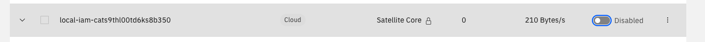
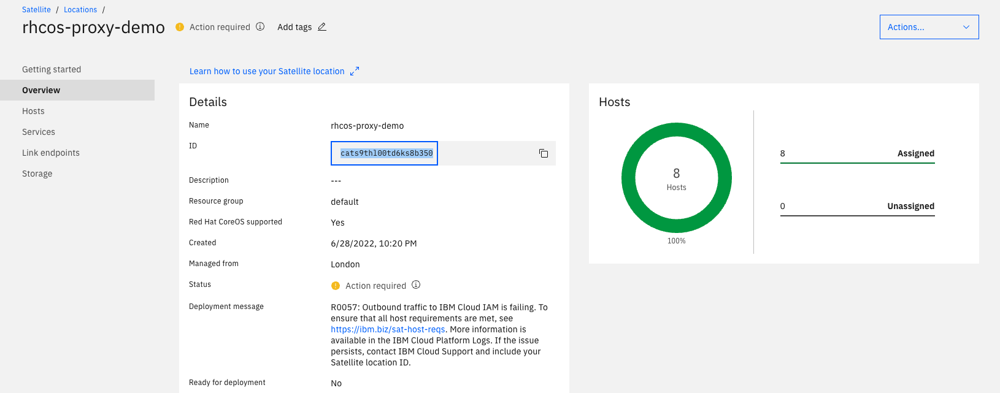
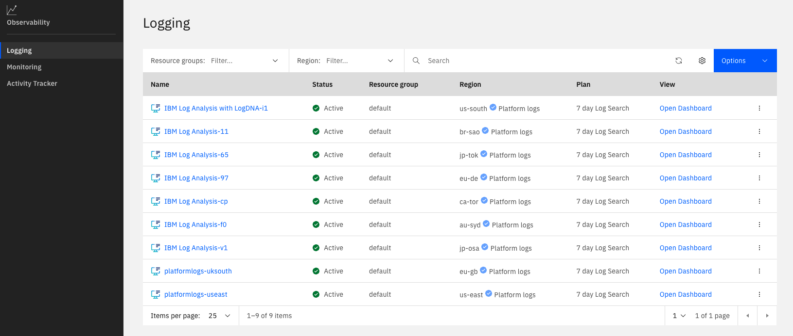
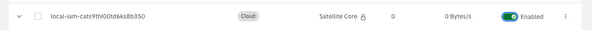
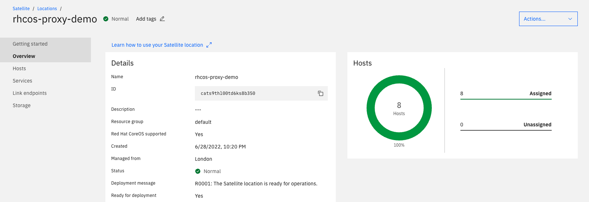

## Satellite Monitoring Automation in Action

In this example we are going to show how IBM Cloud Satellite monitors location health and provides feedback to the user to solve issues. In this lab: we will simulate a problem in which the user has blocked access to IBM Cloud IAM. After blocking the access: we are going to look at the feedback offered by the location in the location status to determine what the problem is. We are also then going to use Platform logs to dig deeper into the specific issue that is occurring. 

### Lab Steps

1. In an existing healthy coreos-enabled location: disable the Satellite link IAM endpoint. [Relevant link](https://cloud.ibm.com/satellite/locations/)
   

2. While waiting for location to detect problem we will go through the [activity tracker lab](../activity-tracker-lab/steps.md)

3. Wait a few minutes for location to enter unhealthy state.
   

4. Then go to platform logs and view relevant logs to error. [Relevant link](https://cloud.ibm.com/observe/logging):
   
   
   

5. Using that information now let's turn back on IAM endpoint and then wait for location to go healthy
   
   

Congrats! The lab is now complete.

Authors: Tyler Lisowski