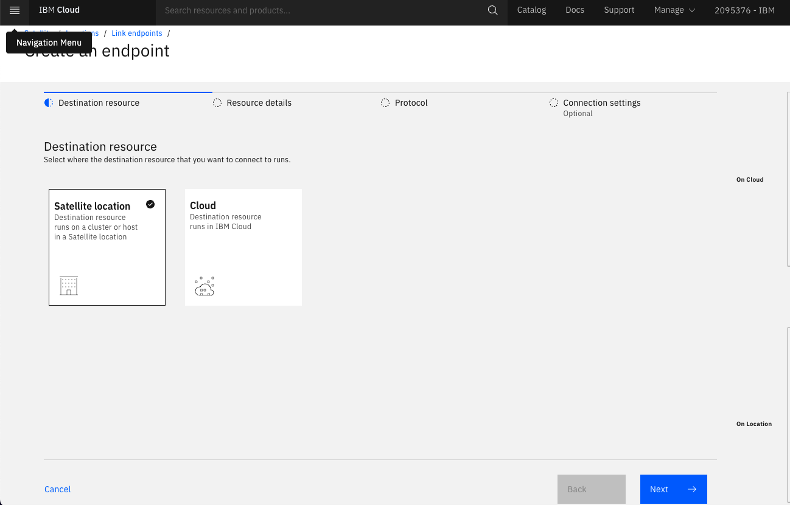
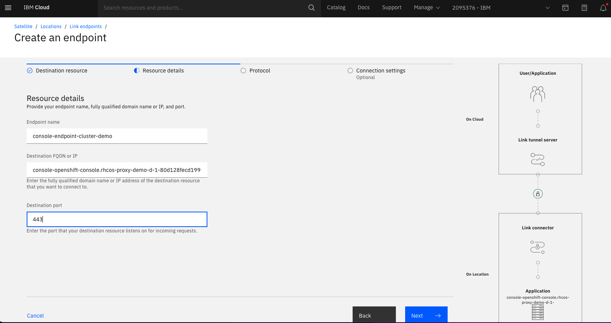
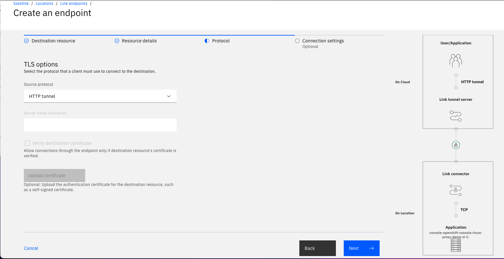
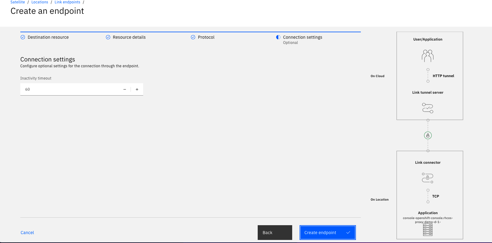
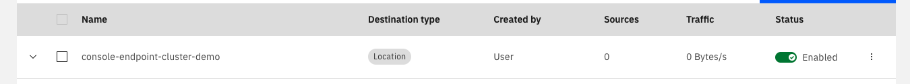
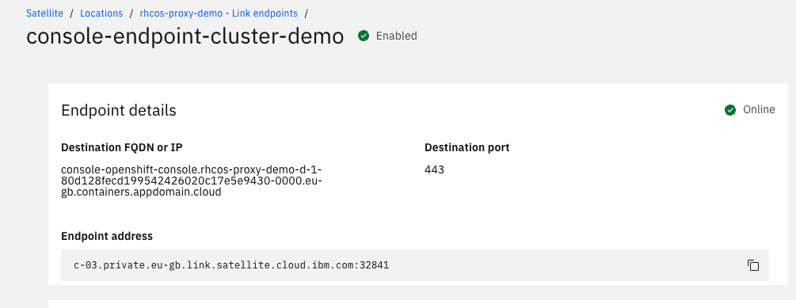
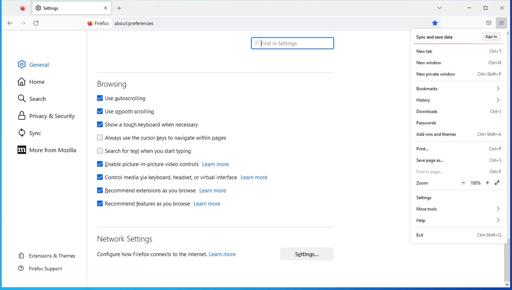
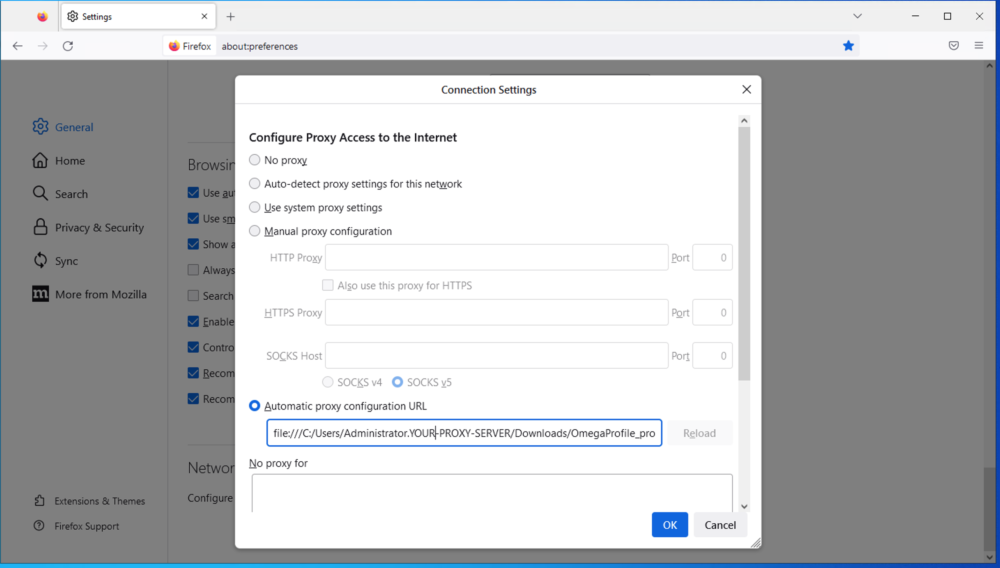
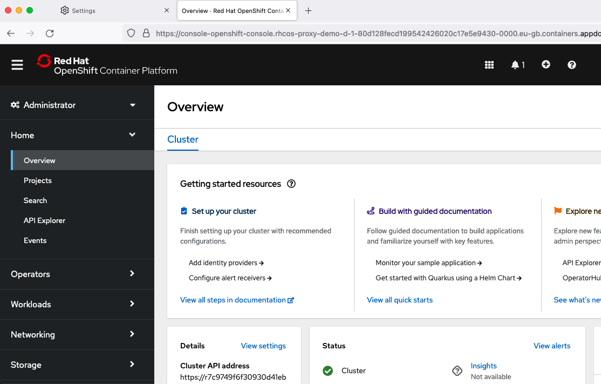
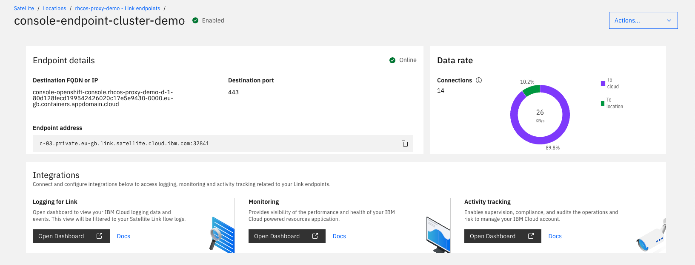

## Using Satellite Link to expose the Openshift Console of a Red Hat Openshift Cluster running in a Satellite location

## Overview

This example will investigate how to obtain access to the OpenShift Console when the ROKS cluster is running in a Satellite location that is contained within a private network (no external IP's are configured on the hosts running the cluster). This method can be used as a short term solution to gain access to the console to continue deployment of Satellite, workloads and management of the cluster or applications.

This method allows access to the OpenShift console in a private network from IBM Cloud over the Satellite Link established while creating a Satellite location. To view the console we will provision a windows VM in IBM Cloud and configure FireFox on it to use a proxy file that routes requests to the Satellite Link(s).

To achieve this goal, we will need to create a link endpoint in IBM Cloud that forwards traffic to the Openshift Console of a Satellite Red Hat Openshift Cluster.

NOTE: The customer has full ability to turn off this communication at any time by disabling the Link endpoints that are created as part of this method.

### Prepare Windows Server Test machine in IBM Cloud

1. Using the IBM CLoud UI, Provision a Windows server in a VPC, make sure to create and attach a SSH public key to the instance (for more info, refer to https://cloud.ibm.com/docs/vpc?topic=vpc-ssh-keys which shows how to create a PEM file using the command option -m PEM). Make sure to create a public floating IP on the Virtual Server instance so the RDP session can connect to your server. For more details, refer to: https://cloud.ibm.com/docs/vpc?topic=vpc-creating-a-vpc-using-the-ibm-cloud-console

2. From your workstation terminal login to IBM Cloud and target the correct resource group and region

   ```sh
   ibmcloud login
   ```

   ```sh
   ibmcloud target -g GROUP -r REGION
   ```

3. Find out the instance id of your VSI (make sure your ibmcloud cli has the `is` plugin installed and use `ibmcloud plugin install is` to install the is component into ibmcloud if needed)

   ```sh
   ibmcloud is instances|grep <your VSI name>
   ```

4. Get Instance details

   ```sh
   ibmcloud is instance <instance id is located in the first column>
   ```

5. Initialize to get password using
   ```sh
   ibmcloud is in-init <instance name> --private-key @<your private key file>
   ```
6. **Note the returned password for user Administrator that the above command generates and store it safely so you can use it to login to windows server**

7. Install the Windows Remote Desktop (RDP) app into your workstation (download from the Mac AppStore if you have a Mac)

8. Create a RDP session to test connectivity to the windows server, and login as administrator with password provided in above step

9. On the windows server, download and install Firefox

### Creating Satellite Link Enpoints to gain access to the OpenShift Console UI

Create the following Satellite Link Endpoints:

1. **Two Satellite link endpoints need to be created, one for the OCP console and another for the Satellite Location control plane**

2. You need two pieces of data for the Satellite link endpoints we will create. The cluster's Ingress Subdomain and the cluster's Satellite Control plan hostname. The following output shows an example of how to get this data.

3. From the terminal logged into IBM cloud, retrieve the details of your Satellite cluster

   ```sh
    ibmcloud ks cluster get --cluster < cluster ID or name >
    Retrieving cluster xxx...
    OK

    Name: xxxx
    ID: xxxxxxxxxxxxxxxx
    State: normal
    Status: All Workers Normal
    Created: 2022-09-14 10:29:29 -0500 (1 month ago)
    Resource Group ID: xxxxxxxxxxxxxxxxxxxx
    Resource Group Name: xxxxxxxxxxxxxxx
    Pod Subnet: xxx.xx.x.x/16
    Service Subnet: xxx.xx.x.x/16
    Workers: 6
    Worker Zones: xxx, xxx, xxx
    Ingress Subdomain: xxx-xxx-0000.us-south.containers.appdomain.cloud
    Ingress Secret: xxx-xxx-0000
    Ingress Status: -
    Ingress Message: -
    Public Service Endpoint URL: https://c-04.private.us-south.link.satellite.cloud.ibm.com:xxxx
    Private Service Endpoint URL: https://xxx-xxx-ce00.us-south.satellite.appdomain.cloud:xxxx
    Pull Secrets: enabled in the default namespace
    VPCs: -
    Pod network interface selection method: -

    Master
    Status: Ready (1 day ago)
    State: deployed
    Health: normal
    Version: 4.10.36_1541_openshift
    Location: xxxxx
    URL: https://xxxx-xxx-ce00.us-south.satellite.appdomain.cloud:xxxxx
   ```

4. From the example output above, we need two hostnames, the hostname next to Ingress Subdomain: and also the hostname of the Master URL. From the above data, these two values would be used:

Ingress Subdomain = xxx-xxx-0000.us-south.containers.appdomain.cloud
Master Control Plane hostname = xxxx-xxx-ce00.us-south.satellite.appdomain.cloud

**Please use your two values from your cluster's output going forward, not the fake values above**

10. Navigate to your [Satellite Locations console](https://cloud.ibm.com/satellite/locations/) and select your location.

11. Click **Link endpoints** > **Create an endpoint**.

12. On the **Destination resource** tab, select **Location** and click **Next**.
    

13. On the **Resource details** tab, enter `console-endpoint-cluster-demo` as the **Endpoint name**. In the **Destination address** field, enter the value: `console-openshift-console.<Ingress Subdomain>` console url using your value for the `<Ingress Subdomain>`. For the **Port** field, enter `443`.
    

14. On the **Protocol** tab, select **HTTP tunnel** as the source protocol check-box and click **Next**.
    

15. On the **Connection settings** tab, keep the default inactivity timeout of `60` , and click **Create endpoint**
    

16. After creating the endpoint, you are redirected to the **Link endpoints** page. Click the `console-endpoint-cluster-demo` endpoint that you just created and view the details.
    

17. Note the **Endpoint Address** contains the address of the HTTP Tunnel endpoint exposed in IBM Cloud that will route traffic to the Openshift Console. This will be used later in the proxy file.
    

18. Create another endpoint for the Satellite control plane in the same fashion. Click **Link endpoints** > **Create an endpoint**. On the **Resource details** tab, enter `satellite-control-plane` as the **Endpoint name**. In the **Destination address** field, enter the value from above for your Master Control Plane hostname: `< Master Control Plane hostname >`. For the **Port** field, enter `31794`.

**Important this port (31794) may not be correct. I only figured out my port here after the process was failing in FireFox. This should be the oauth redirect port, which may change for every cluster. In the next section, if you get an error, notice the port of the control plane that FireFox is trying to redirect to, if this is different than 31794, edit this entry and change to what your oauth redirect port is.**

## Preparing Proxy Configuration in FireFox on the Windows Server

In order for Firefox to be able to communicate with your private, remote OpenShift Console, a proxy needs to be used to communciate through the Satellite endpoint links you have created

1. Download the [sample .pac file](./OmegaProfile_proxy_example2.pac). This PAC file will be used to configure the FireFox proxy settings. You need to replace your link endpoints that you created and your console url and master control plane data into this proxy file. Make sure to escape any '.' in the hostname and replace any us-south entry with your region. This file gets processed in order as follows:

Match anything related to IBM Cloud or auth to IBM Cloud or anything localhost just `RETURN DIRECT` (which is like a pass-through)
Match anything starting with your Master Constrol Plane host and return the Master Control Plane host Link Endpoint and Port
Match anything starting with your OpenShift Console application (console.openshift.console.< Ingress Subdomain >) and return the
console-endpoint-cluster-demo Link Endpoint and Port
If everything falls through, `RETURN DIRECT`

2. Through RDP, on the Windows Server, create a file in the downloads area in your Window's Administrator account called OmegaProfile_proxy.pac and copy the contents of your changed/updated downloaded proxy file into the file on the remote server

3. Configure your FireFox browser to use this proxy file by launching FireFox, select settings, scroll to bottom,
   

and then select Network Settings and then select the radio button `Automatic proxy configuration URL` and load the file you saved with your adjusted proxy values. Use the format shown in the image: `file:///C:/Users/Administrator.YOUR-PROXY-SERVER/Downloads/OmegaProfile_proxy.pac`


**NOTE if you make changes to this file, you will need to reload them before testing in FireFox by hitting the Reload button after saving changes to the file**

4. Enter the OpenShift Console URL into the FireFox browser and then complete the IBM Cloud login steps to access the Openshift Console. After you are validate with IBM Cloud oauth, you will be redirected to your OpenShift Cluster Console UI through the Satellite link endpoint. If you get errors here, please note the port of the Master Control Plane hostname that your console is trying to talk to. Use this port in your link endpoint instead of 31794.



1. Verify traffic has been sent over the endpoint by looking at **Data rate** panel on the **Endpoint details** page.
   

## Adding another application's route to view its UI through a Satellite link endpoint

## If you are still experiencing errors

1. Review your proxy file for any formatiing errors
2. Make sure the proxy file has the correct hostname and values
3. Make sure you have created the link endpoint with the correct FQDN and ports, both use HTTP Tunnel as the protocol

Congrats! The lab is now complete.

Authors: Tyler Lisowski, Jagan Dusi, Dave Bellagio

```

```
