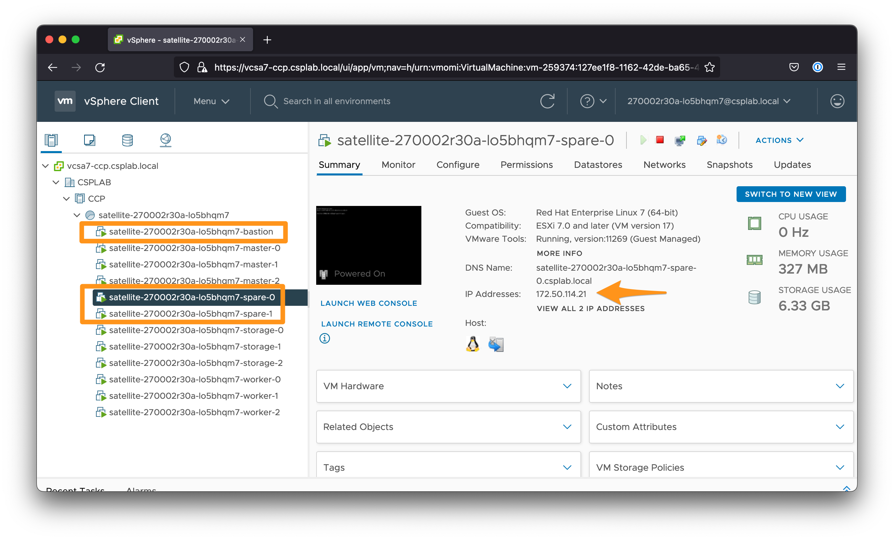
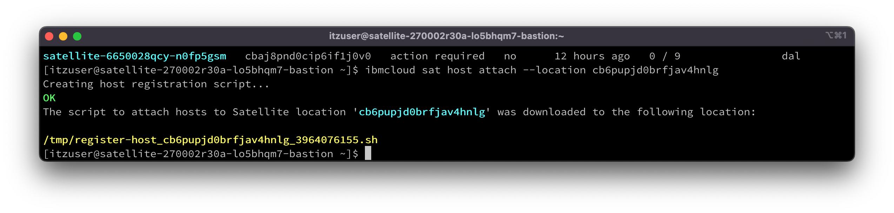
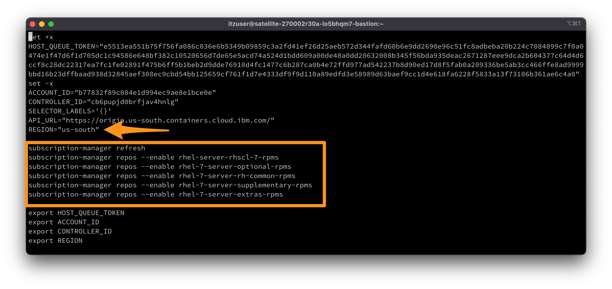
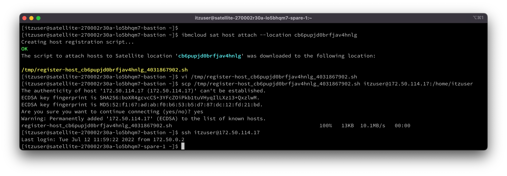
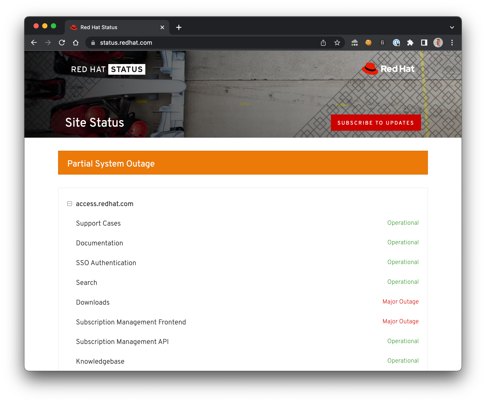

# Adding Hosts to VMWare based Satellite Location

## Review

The following resources are created by the VMWare template in the account you've been invited to

- 1 host for the bastion
- 3 hosts named master for the Satellite Control Plane
- 3 hosts named worker for the OpenShift worker nodes
- 3 hosts named storage for ODF
- 2 hosts spared not attached to the location yet.

## Retrieve the IPs of the bastion and the two RHEL hosts

We would like to add to our existing location 2 hosts we need later for other exercises. In a real customer environment you would automate the following steps, using Terraform, Ansible or other automation capabilities.

1. Connect to vSphere client to retrieve the IP of the bastion and the 2 hosts by following these [instructions](./vmware-prework.md#connect-to-vsphere-client). You will need those IPs to SSH in each machine later.

   

1. Connect to the **bastion** host following these [instructions](./vmware-prework.md#connect-to-the-bastion-through-ssh)

1. Download and install the IBM Cloud CLI on the bastion linux host

   ```sh
   curl -fsSL https://clis.cloud.ibm.com/install/linux | sh
   ```

1. Install the IBM Cloud plug-in for Kubernetes Service.

   ```sh
   ibmcloud plugin install container-service
   ```

## Attaching the Hosts to the IBM Cloud Satellite location

Let's attach the hosts to our IBM Cloud Satellite location.

1. From the bastion, connect via IBM Cloud CLI to the IBM Cloud account
  
   ```sh
   ibmcloud login --sso
   ```

   Select the account (i.e. `ITZ - Satellite`)
   Select the region (i.e. `us-east`)

1. Select the Resource Group where your location was created.

   ```sh
   ibmcloud target -g Satellite
   ```

1. Identify your Satelitte location from the list.

   ```sh
   ibmcloud sat location ls
   ```

1. Download the Satellite Location Host register script
  
   ```sh
   ibmcloud sat host attach --location <your-location-ID>
   ```

   

1. Open the registration script. 

   ```sh
   vi <path_to_register-host.sh>
   ```

1. Edit the Script to enable RHEL repos

   After the `REGION` line, add a section to pull the required RHEL packages with the subscription manager.

   ```sh
   subscription-manager refresh
   subscription-manager repos --enable rhel-server-rhscl-7-rpms
   subscription-manager repos --enable rhel-7-server-optional-rpms
   subscription-manager repos --enable rhel-7-server-rh-common-rpms
   subscription-manager repos --enable rhel-7-server-supplementary-rpms
   subscription-manager repos --enable rhel-7-server-extras-rpms
   ```

      

1. Copy the script from the bastion machine to the spared host.

   ```sh
   scp <path_to_register-host.sh> itzuser@<spared_host_ip_address>:/home/itzuser/
   ```

1. SSH into the spare machine

   ```sh
   ssh itzuser@<spared_host_ip_address>
   ```

   

1. Make the script executable

   ```sh
   chmod +x <path_to_register-host.sh>
   ```

1. You need to be root on the machine to run the script.

   ```sh
   sudo su
   ```

   > Request the password to the instructor.

1. Run the registration script on your machine even if the session is disconnected

   ```sh
   nohup bash <path_to_register-host.sh> &
   ```

1. Monitor the progress of the registration script. Wait.

   ```sh
   journalctl -f -u ibm-host-attach
   ```

1. Repeat thoses steps on the second spare host.

1. Check that your hosts are shown in the **Hosts** tab of your Sattelite location.

   

## Troubleshooting

1. The attach script may fail if the Red Hat `Downloads` and the `Subscription Management Frontent` are having an outage. That happened to me! Check its status on [https://status.redhat.com/](https://status.redhat.com/).

   
