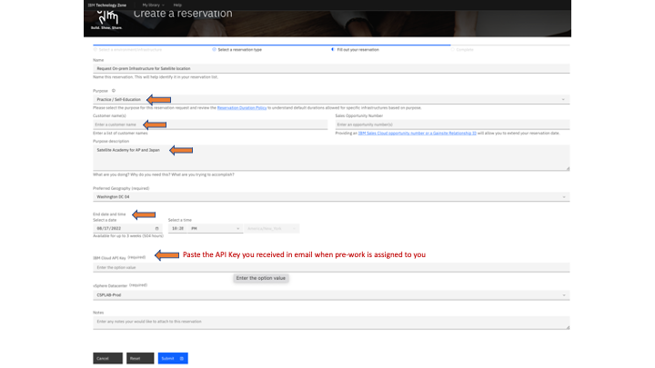
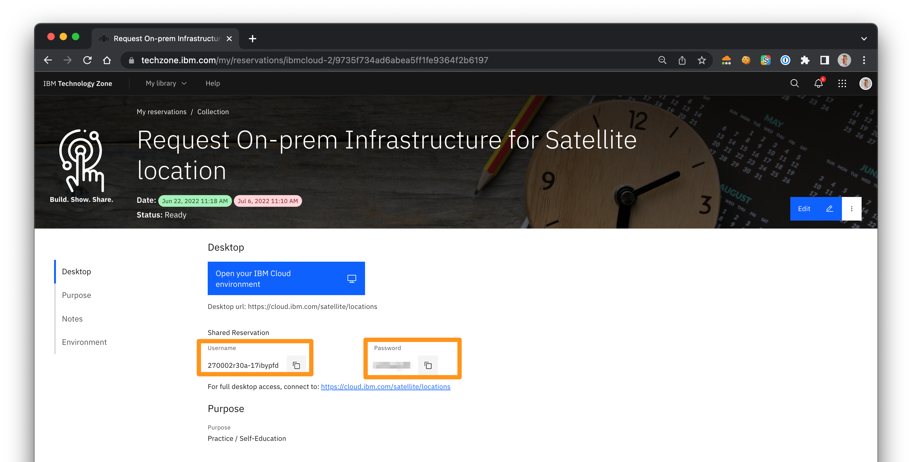
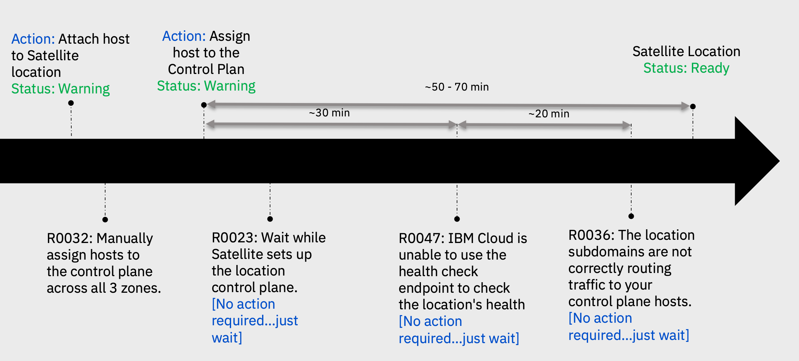

# Do It -- Build On-prem Demo Environment for Satellite using VMWare

> This document is tailored for the Satellite Tech Academy Students.
>
> Overall duration: 3+ hours

## Table of Contents

1. [Purpose](#purpose)
2. [Overview](#overview)
3. [Target audience](#target-audience)
4. [Pre-requisites](#pre-requisites)
5. [Techzone](#techzone)
    1. [How to request a Satellite-VMWare environment on Techzone](#how-to-request-a-satellite-vmware-environment-on-techzone)
    2. [Connect to the environment through VPN](#connect-to-the-environment-through-vpn)
    3. [Connect to the bastion through SSH](#connect-to-the-bastion-through-ssh)
    4. [Connect to vSphere Client](#connect-to-vsphere-client)
6. [Satellite](#satellite)
    1. [Verify Satellite location is created](#verify-satellite-location-is-created)
    2. [Assign hosts to the Satellite Control Plane](#assign-hosts-to-the-satellite-control-plane)
7. [OpenShift](#openshift)
    1. [Deploy Red Hat OpenShift onto on-prem Satellite location](#deploy-red-hat-openshift-onto-on-prem-satellite-location)
    2. [Access OpenShift using the IBM Cloud CLI](#access-openshift-using-the-ibm-cloud-cli)
    3. [Access the OpenShift Console](#access-the-openshift-console)
8. [OPTIONAL](#optional)
    1. [Access OpenShift using Satellite Link Endpoint with CLI](#access-openshift-using-satellite-link-endpoint-with-cli)
    2. [Review DNS configuration](#review-dns-configuration)

## Purpose

This document helps complete pre-requisites for the Satellite Academy session. Students will perform following steps as pre-reqs

1. Deploy Satellite location VMware infrastructure on-prem

1. Deploy Red Hat OpenShift cluster

1. **Optional** -- Configure OpenShift cluster for public access. This step will be facilitated to perform as part of Academy lab, but if you are interested you can try.

## Overview

IBM Cloud Satellite can be deployed anywhere including on-prem or other clouds or at the Edge, however, this exercise helps you experience it by creating Satellite location in an on-prem location using VMWare in a Secured Private Network.

This demo collection provides a fully automated method to provision infrastructure for Satellite, create a Satellite location, and attach the hosts to the Satellite location.

This demo includes deploying Red Hat OpenShift cluster onto that Satellite location. That builds a container platform that is ready for developers to build and run cloud native applications.

This Tech Zone demo collection is specially created for the Satellite Academy and is available [https://techzone.ibm.com/collection/cloud-platform-tech-academy-satellite](https://techzone.ibm.com/collection/cloud-platform-tech-academy-satellite).

## Target audience

IBM Cloud Sellers, Tech Sales, CSM, CSC, Client Engineering and Business Partners

## Pre-requisites

To experience Satellite using on-prem infrastructure, access is needed to both VMware and IBM Cloud environments.

The IBM Cloud environment allows you to create the Satellite location, deploy the OpenShift clusters or other software like Cloud Pak for Data, Integration while the VMWare environment allows you to provision the compute, storage and Network infrastructure required to host the Satellite location.

The diagram below shows the demo environment that needs to be built. The environment can be reserved in TechZone.


## Techzone

### How to request a Satellite-VMWare environment on Techzone

> Duration for requesting env: 5 min
>
> Duration for provisioning : 80-90 min

1. In [TechZone](https://techzone.ibm.com/collection/cloud-platform-tech-academy-satellite), select the **Environments** section.

    

1. Click on the resource named **Request On-prem VMware Infrastructure for Satellite** to obtain compute, storage and Network configuration to setup a Satellite location on-prem.

    

1. Select a reservation type e.g. **Reserve now**

    

1. Fill out your reservation and click **Submit**.

    

1. You can check the status of the reservation on the [My reservations](https://techzone.ibm.com/my/reservations) page

    

    

1. This environment provides access to ***'IBM Cloud Environment***" which provides an API Key, and your individual IBM id gets added to the TechZone Enterprise Account owned by TechZone in IBM Cloud.

1. Your environment will be provisioned in about `60 - 90 min` as the provisioning includes following steps:

    * Create a Satellite location, create 9 VMs, assign private IP addresses and attach all 9 hosts to the Satellite location.

    * Create credentials for VPN access to IBM Cloud Adoption Lab

    * Grant access to VMWare vSphere Client Console

    * Add your id to IBM Cloud account owned by TechZone '1234567 - ITZ - Satellite'

1. Expect a first email from `techzone.help@ibm.com` with the subject `Your environment is ready` once the requested environments are created, confirming access to VMWare and IBM Cloud with required credentials.

    

1. Once your request is completed, you will also be added to IBM Cloud Account `ITZ - Satellite`. Expect a second email from `no-reply@cloud.ibm.com` with the subject `You are invited to join an account in IBM Cloud`

    

1. Click on the Link for **Join now**

1. Then, Click on **Accept Invite** button

    

1. Now, Login to IBM Cloud account

    

1. At the top menu of the IBM Cloud Console, make sure you Switch to the `ITZ - Satellite` account to which you were invited:

    

    > CAUTION: Not switching to ITZ account will result in charges hitting to your own individual account or other account you create you resources in.
    >
    > The following are made available to you:
    >
    > * A user id and password are created for you to access the VPN as the VMWare infrastructure is behind a firewall and not publicly accessible over internet
    >
    > * 9 VMs are automatically created and provisioned in the secured sub network with minimum storage needed
    >
    > * A Satellite location is already created for you and the location name is provided in the email
    >
    > * A Host attach script is executed to attach all the six VMs to the Satellite location and ready for you to assign them to how you need it.
    >
    > * You need to assign three VMs to Satellite control plane and another three VMs to Red Hat OpenShift cluster when needed.
    >
    > * You are also provided access to vSphere Client Console, using same user name and password as VPN credentials.
    >
    > * You can also verify status of your request for the Environment by going to My Library and click on My Reservations
    >
    > NOTE: If you see your request has failed provisioning or you received an email stating so, please go ahead and submit another request.

### Connect to the environment through VPN

> Duration: 10 min

Some of steps later one will require you to be connected via VPN to the Private Network where Satellite location and attached hosts are physically provisioned. Let's test the VPN and SSH connection.

1. In the email `Your environment is ready` you received, click on the [CSPLAB VPN Instructions](https://csplab.dfw.ibm.com/) and follow the instructions to connect to VPN (or Tunnelblick app can be used) and connect using user id and password provided.

    

### Connect to the bastion through SSH

> Duration: 5 min

1. Go to your [My reservations](https://techzone.ibm.com/my/reservations). Select your reservation.

    

1. Write down the **Bastion SSH IP**, the **Bastion SSH Username** (e.g. itzuser) and the **Bastion SSH Password**.

1. Download the **SSH Private Key** by clicking the button at the bottom of this page. You should be downloaded a file with the name `pem_bastion_download.cer`.

1. Set the right permission of this SSH key.

    ```sh
    chmod 600 pem_bastion_download.cer
    ```

1. Connect in ssh.

    ```sh
    ssh -i pem_bastion_download.cer itzuser@<Bastion SSH IP>
    ```

    Output

    

### Connect to vSphere Client

> Duration: 5 min

1. Go to your [My reservations](https://techzone.ibm.com/my/reservations). Select your reservation.

    

1. Write down the **username**, and the **password** at the top of the page.

1. Open the [vSphere Client Console](https://vcsa7-ccp.csplab.local/ui/) and enter your credentials.

    

1. Once you're logged in, you will be able to see all the hosts. Select one of the host such as the bastion.

    

## Satellite

### Verify Satellite location is created

> Duration: 5 min

1. Go to the left Navigation Menu at the top left corner of the top menu, and to the left of **IBM Cloud** and the click on **Satellite** Locations.

    

1. Search for the Satellite location, with the name provided in the email sent by IBM Technology Zone.

    

1. Click on the location that was created and is in the state `Action Required`

1. On the Overview page, see the Managed from location and the number of Hosts attached

    

1. On left side menu, click on **Hosts** to show the hosts attached to the location and the hosts available for the Red Hat OpenShift cluster or other Cloud Services.

    

### Assign hosts to the Satellite Control Plane

> Duration: 20 min

First step is to assign 3 hosts to Satellite location control plane. When you attach/assign your 3 control plane hosts, you need to specify which zone each host should be assigned to.

1. Look for host name ending with master-0, and click on 3 dots on the right and click **Assign host**.

    

1. Select Control Plane for Cluster, csplab-zone-1 for Zone and click the **Assign host** button at the bottom of the panel.

    

    > **CAUTION**: If you incorrectly assign Zone, that particular host may become unusable and need to be replaced.

1. Repeat steps for host names ending with master-1 and master-2 while making sure you perform the assignement below.

    | Host        | Cluster           | Zone  |
    | ------------- |:-------------| -----|
    | satellite-XXXXX-master-0 | Control plane | csplab-zone-1 |
    | satellite-XXXXX-master-1 | Control plane | csplab-zone-2 |
    | satellite-XXXXX-master-2 | Control plane | csplab-zone-3 |

1. Now check status which should show Hosts are in `provisioning state`.

1. Wait for about 20 min for provisioning to be completed and Status to change to Normal and Availability to Assigned

    

Below is a potential errors you might see during the install process:



## OpenShift

### Deploy Red Hat OpenShift onto on-prem Satellite location

> Duration: 40 min

1. You can deploy Red Hat OpenShift from the Satellite Services page:

    

1. click on **Create services**.

1. Select **Red Hat OpenShift on IBM Cloud**.

    

1. Select **Manual Setup**, and **Satellite** as your Infrastructure of choice

    

1. Now, you can see all the Satellite locations available including your on-prem locations or other clouds.  In the name column, make sure the Satellite location you just created is selected

    

1. Under **Default worker pool**, you will notice the warning `Minimum host requirements are not met`.

    

1. To fix it, click on **Get values from available hosts**. By default, you will see 3 storage hosts with 16 vCPU and 64 GB.

    

1. We want to use worker node hosts. So, change the Memory value from 64 GB to 32 GB.

    

1. Click **Set worker pool to match this host configuration**. The previous warning should have disappear.

    

1. Under **Orchestration services**, choose the latest version of OpenShift such as 4.10.17.

1. Under **OCP Entitlement**, keep the default option `Purchase additional licenses for this cluster`.

1. Under **Satellite Config**, check the box `Enable Cluster admin access to Satellite Config` to manage Kubernetes resources in this clusters.

1. Enter a unique name for the cluster name e.g. `mycluster-satellite-XXX` in the Resource details.

1. Click on the **Create** button on right highlighted in Blue to submit the deployment.

1. Let's confirm that the cluster is created in Satellite location. Go to top left Navigation Menu, go to Satellite and then to Clusters

    

1. Here you see the cluster `mycluster-satellite-XXX` you just created, using Satellite as infrastructure. On the row with the cluster name for `mycluster-satellite-XXX`, click on the corresponding Satellite location.

    

1. In the Satellite -> Locations page, click on Hosts and see if worker nodes are assigned

    

1. As we matched the vCPU - Memory at the cluster creation time, you should see your worker hosts being automatically assigned.

    

1. If the hosts are not already assigned, start assigning worker nodes to the Red Hat OpenShift cluster

    

1. Now look for host name ending with worker-0, click on 3 dots on the right and click Assign host.

1. Select the Red Hat OpenShift cluster `mycluster-satellite-XXX`, zone "csplab-zone-1" and click Assign Host at the bottom.

    

    > CAUTION: If you incorrectly assign hosts to the Control Plane or incorrect Zone , that particular host may become unusable and need
    to be replaced

1. Repeat steps for host names ending with worker-1 and worker-2 while make sure you have the following assignment:

    | Host        | Cluster           | Worker Pool  | Zone  |
    | ------------- |:-------------| -----| -----|
    | satellite-XXXXX-worker-0 | mycluster-satellite-XXX | default |csplab-zone-1 |
    | satellite-XXXXX-worker-1 | mycluster-satellite-XXX | default |csplab-zone-2 |
    | satellite-XXXXX-worker-2 | mycluster-satellite-XXX | default |csplab-zone-3 |

1. Now check the status which should show Hosts are in `Provisioning` state.

    

1. If you check status on cluster for worker nodes you see this, wait until completion

    

1. Wait for about 20-30 min for provisioning to be completed and Status to change to Normal and Availability to Assigned

    

1. Now if you go to Red Hat OpenShift cluster and checked on worker nodes status, they will be shown as Normal as depicted below:

    

### Access OpenShift using the IBM Cloud CLI

> Duration: 10 min

1. Since the Satellite location and Red Hat OpenShift cluster are in a private Network, in order to access OpenShift using CLI, you need to use SOCKS server.

1. However, due to issues with MAC to support SOCKS, please use a work around for the purpose of the demo.

1. For MAC users, this workaround requires Node JS to be installed

    ```sh
    brew install node
    ```

1. Install http-proxy-to-socks (hpts) by running the command

    ```sh
    sudo npm install -g http-proxy-to-socks
    ```

1. Open another terminal window and start hpts in listening mode by running the command

    ```sh
    hpts -s 172.19.237.50:1080 -p 9999
    ```

    > The IP address 172.19.237.50 is for the SOCKS server provided by TechZone.

1. Make sure you are connected to VPN provided by TechZone as Red Hat OpenShift cluster is behind the firewall in a private secured subnet. If you're not already connected, refer to this section [Connect to the environment through VPN](#connect-to-the-environment-through-vpn).

1. In the IBM Cloud Console, create an API Key by going into Manage > IAM.  Click on API Keys on left side pane and on right side click on `Create an IBM Cloud API Key`

    

1. On your other terminal, now login to IBM Cloud using your new API Key

    ```sh
    ibmcloud login --apikey <your IBM Cloud API Key>
    ```

1. Download the key or copy paste into a file to reuse in next steps.

1. Now set the environment variable to use hpts by running the command

    ```sh
    export https_proxy=http://localhost:9999
    ```

1. Login to OCP cluster from command line

    ```sh
    ibmcloud ks cluster config --cluster <roks clustername> --admin
    ```

1. Verify you are connected to OpenShift cluster by running

    ```sh
    oc get nodes
    ```

    You should see the nodes in this cluster:

    

Congratulations! You are connected to the cluster. You're ready to run OpenShift commands to manage cluster using CLI.

### Access the OpenShift Console

> Duration: 5 min

The Satellite location is registered with DNS using private IP addresses of the hosts assigned to control plane. The intent of this demo is to show a running Red Hat OpenShift cluster in an on-premises private Network so there are no public IP addresses available and OpenShift Console will NOT be available over public network

Since the Satellite location and OpenShift cluster with the assigned hosts are in a Private Network, you will need to connect to the VPN in order to access the OpenShift Web console UI.

You must also make sure to configure Proxy server within your browser to access the OpenShift web console. The SOCK server to use is 172.19.237.50 and port 1080.

1. In Firefox, go to the Settings and search for `socks`

    

1. Enter the following information:

    

1. In the same browser where you set the SOCK server (e.g. Firefow), login to IBM Cloud console, and click on the cluster, then on the right, click on **Manage cluster**

    

1. Click on **OpenShift web console** button

    

1. CONFIRM OpenShift web console can be accessed from the browser

    

## OPTIONAL

### Access OpenShift using Satellite Link Endpoint with CLI

1. Setup a test VSI on IBM Cloud VPC

1. Login to that VSI using SSH key

1. From the test VSI login to IBM Cloud using your API Key

1. Now connect to the OpenShift cluster using the command below to connect over Satellite Link endpoint

    ```sh
    ibmcloud ks cluster config --cluster <cluster-name> --admin --endpoint=link
    ```

1. You can perform all CLI functions using this connection method.

### Review DNS configuration

Refer to following commands to review your DNS and NLB-DNS configuration

1. Store the location name in an environment variable

    ```sh
    export LOCATION_NAME=<your_location_name>
    export CLUSTER_NAME=<your_cluster_name>
    ```

1. Review the location subdomains and check the Records for the private IP addresses of the hosts that are registered in the DNS for the subdomain.

    ```sh
    ibmcloud sat location dns ls --location $LOCATION_NAME
    ```

1. Update the location subdomain DNS records with the public IP addresses of each host in the control plane

    ```sh
    ibmcloud sat location dns register --location $LOCATION_NAME --ip <host_IP> --ip <host_IP> --ip <host_IP>
    ```

1. Verify that the public IP addresses are registered with your location DNS records.

    ```sh
    ibmcloud sat location dns ls --location $LOCATION_NAME
    ```

1. Get the Hostname for your cluster in the format
    `<service_name>-<project>.<cluster_name>-<random_hash>-0000.upi.containers.appdomain.cloud` and note the private IP(s) that were automatically registered

    ```sh
    ibmcloud oc nlb-dns ls --cluster $CLUSTER_NAME
    ```

1. Add the public IP addresses of the hosts that are assigned as worker nodes to this cluster to your cluster's subdomain. Repeat this command for each host's public IP address.

    ```sh
    ibmcloud oc nlb-dns add --ip <public_IP> --cluster $CLUSTER_NAME --nlb-host <hostname>
    ```

1. Remove the private IP addresses from your cluster's subdomain. Repeat this command for all private IP addresses that you retrieved earlier.

    ```sh
    ibmcloud oc nlb-dns rm classic --ip <private_IP> --cluster $CLUSTER_NAME --nlb-host <hostname>
    ```

1. Verify that the public IP addresses are registered with your cluster subdomain.

    ```sh
    ibmcloud oc nlb-dns ls --cluster $CLUSTER_NAME
    ```
