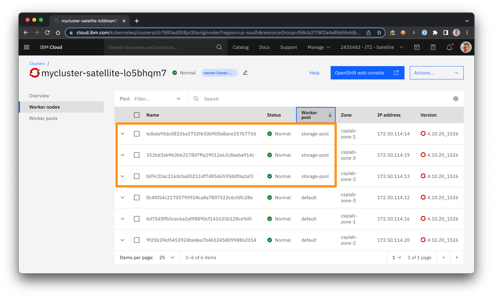
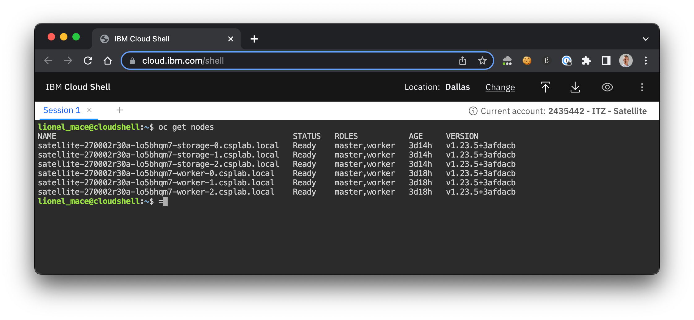
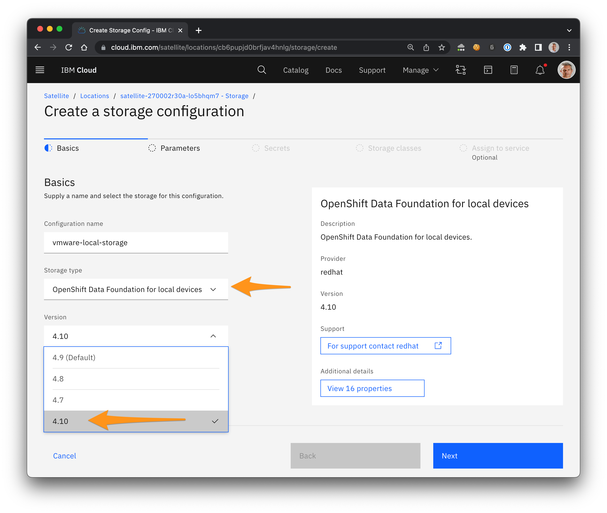
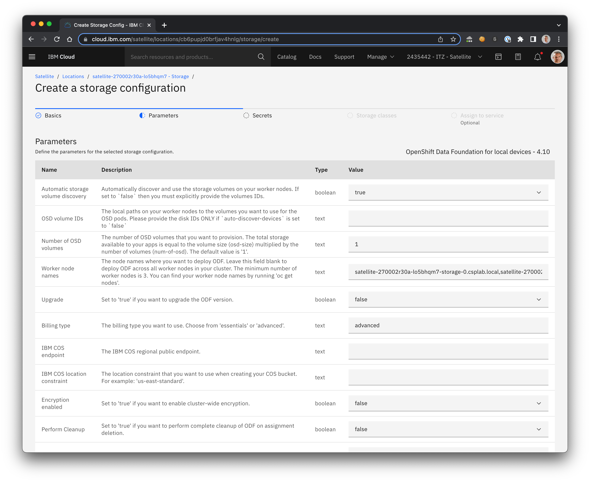
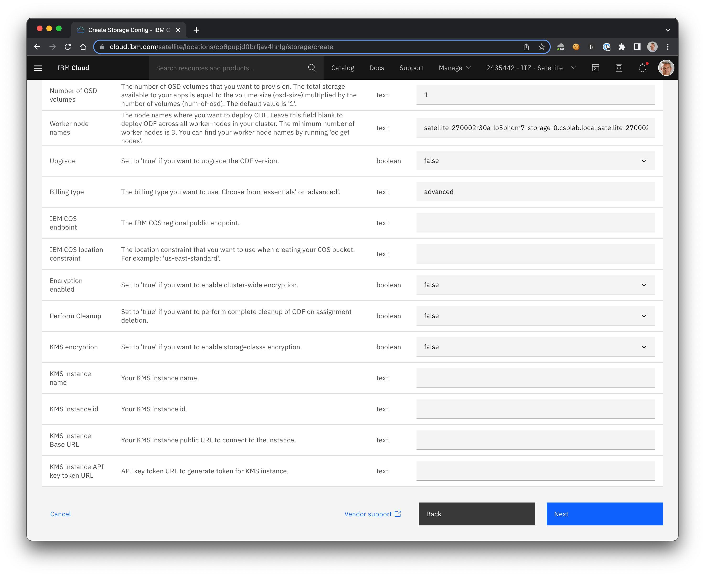
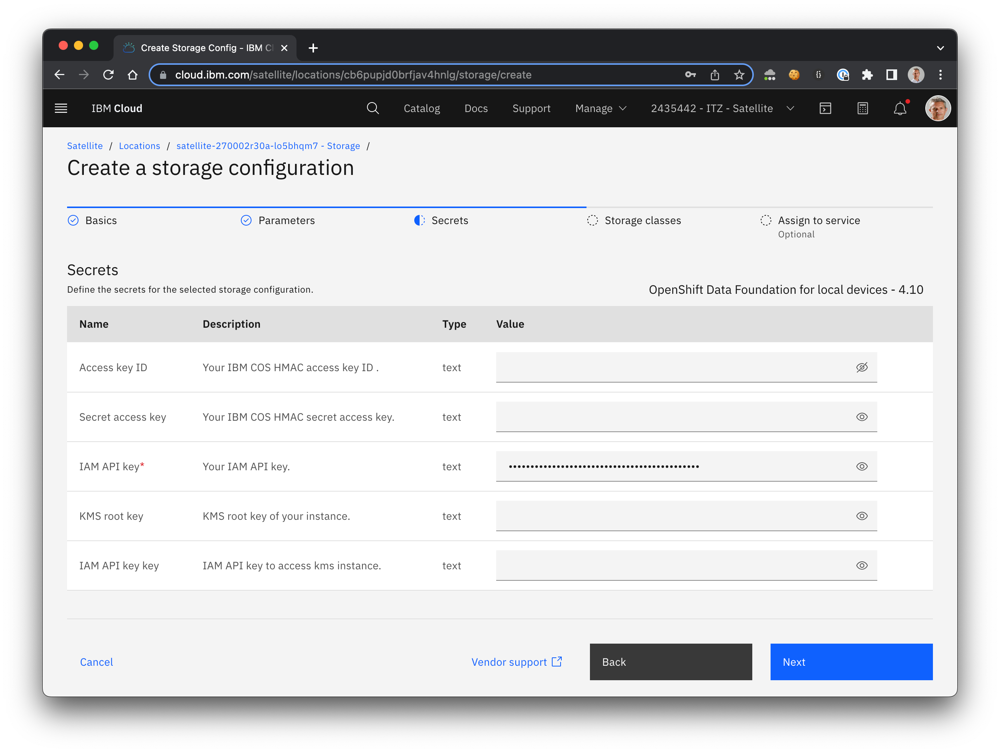
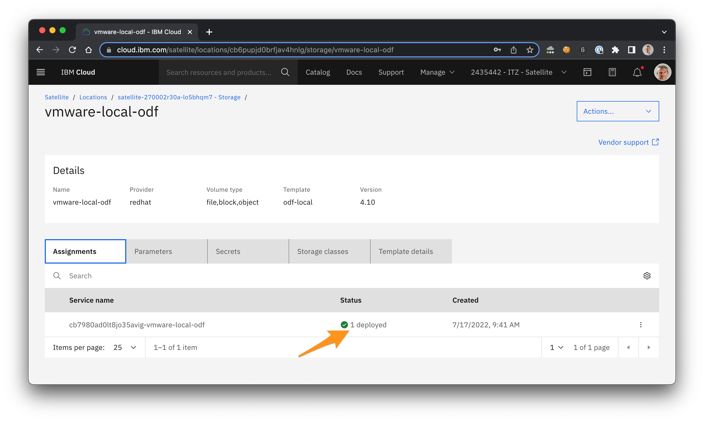
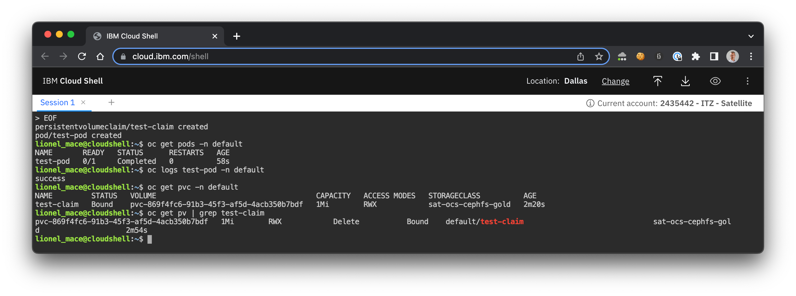

# Install Openshift Data Foundation on Satellite based ROKS Clusters on VMWare

## Table of Contents

1. [Introduction](#introduction)
1. [Create a storage worker pool in the cluster](#create-a-storage-worker-pool-in-the-cluster)
1. [Retrieve the worker node names](#retrieve-the-worker-node-names)
1. [Configure ODF for local devices storage configuration in Satellite](#configure-odf-for-local-devices-storage-configuration-in-satellite)
1. [Check the ODF deployment through the CLI](#check-the-odf-deployment-through-the-cli)
1. [Test ODF with an example application](#test-odf-with-an-example-application)
1. [Check ODF Deployment in the Console](#check-odf-deployment-in-the-console)

## Introduction

We would like to deploy OpenShift Data Foundation Add-on to our Satellite based OpenShift Cluster on VMWare using local disks. The procedure contains the following major steps

* Configuration of a VMWare storage configuration for our location and assign to our ROKS Cluster
* Deploy ODF using Satellite ODF storage configuration referencing Storage class

This lab assumes you already have an OpenShift cluster deployed in your Satellite location.

## Create a storage worker pool in the cluster

> Duration: 20 min

ODF could be installed across all the worker nodes of the cluster. Yet, the VMWare Infrastructure still have hosts dedicated for storage. As we do not want to install ODF on all hosts, we will create a dedicated pool for those hosts.

1. From your Satellite location page, select the **Services** menu in the left hand side panel, then click on your cluster name.

    

1. In the cluster, select the **Worker pools** menu.

    

1. Click **Add** to create a new worker pool. Give a meaningful name to this pool such as `storage-pool`.

    

1. Click **Get values from available hosts** to match the sizing host

    

1. Validate by clicking **Set worker pool to match this host configuration**.

1. The warning `Minimum host requirements are not met` should have disappeared. Click **Create** pool.

1. Select **Worker nodes** menu to find out the status of the deployment.

    

1. Make sure the new worker nodes for storage have the Status `Normal`.

    

> Deploying the new storage worker pools will take 30-40 minutes. You may see the error mesage `Critical - Not Ready` after a while. Wait a bit more and your worker pool will turn on `Normal`.

## Retrieve the worker node names

ODF could be installed on all the worker nodes of the cluster. Yet, we decided to install ODF only on the Dedicated Storage worker nodes. Thus, we need to retrieve the worker node names before we install the storage configuration.

1. Connect to the cluster throught the Cloud Shell following those [instructions](common/cloud-shell/readme.md).

1. Run the command

    ```bash
    oc get nodes
    ```

    

    For example, the 3 storage node names in this cluster are:
    * satellite-270002r30a-lo5bhqm7-storage-0.csplab.local
    * satellite-270002r30a-lo5bhqm7-storage-1.csplab.local
    * satellite-270002r30a-lo5bhqm7-storage-2.csplab.local

## Configure ODF for local devices storage configuration in Satellite

1. From the Satellite locations dashboard, select the location where you want to create a storage configuration.

1. Select Storage > **Create storage configuration**.

    

1. Enter a name such as `vmware-odf-storage` for your configuration. Select the Storage type **OpenShift Data Foundation for local devices** and the Version **4.10**. Then, click Next.

    <!--  -->
    

1. In the Parameters tab, make sure the value **Automatic storage volume discovery** is set to true. Enter the name of the 3 worker nodes you retrieved in the previous steps separated by comma.

    

1. Keep the default values for all the other options.

    

1. On the **Secrets** tab, enter your IAM API key which is mandatory. Keep the other options empty.

    <!--  -->
    

1. On the **Storage classes** tab, review the storage classes that are deployed by the configuration.

    <!--  -->
    

1. On the **Assign to service** tab, select your cluster that you want to assign your configuration to.

    

1. Click **Complete** to assign your storage configuration.

1. Once the deployment is complete, you should see 1 deployment:

    

## Check the ODF deployment through the CLI

For more detailled descriptions of the following steps look also in the [Satellite Docs](https://cloud.ibm.com/docs/satellite?topic=satellite-config-storage-odf-local&interface=cli)

1. Connect to your Satellite Location through the [Cloud Shell](https://cloud.ibm.com/shell).

    ```sh
    ibmcloud target -g Satellite -r us-south
    ```

    

1. List the Satellite locations to retrieve the  ID of your location.

    ```sh
    ibmcloud sat location ls
    ```

1. List the OpenShift clusters to retrieve the ID of your cluster.

    ```sh
    ibmcloud oc cluster ls --provider satellite
    ```

1. Verify that your cluster has a valid storage configuration has applied.

    > Make sure to use the location and cluster id and ***NOT*** the name.

    ```sh
    ibmcloud sat storage assignment  ls --location <location_id> --cluster <cluster_id>
    ```

    

1. You can check the config is being applied to your cluster listing Razee "RemoteResource"

    ```bash
    oc get rr -n razeedeploy
    NAME                                                       AGE
    clustersubscription-6cd6ea3d-c348-45e2-8048-67e319f4177d   8m24s
    clustersubscription-system-primaryorgkey                   46h
    ```

1. What you also will see that we already have Storage classes deployed, which could be used by ODF. Connect to your cluster and list the storage classes:

    ```sh
    # remove endpoint parameter if you connect via public IPs
    # use endpoint parameter if you connect from cloudshell
    ibmcloud ks cluster config --admin --endpoint link -c <your cluster> 
    oc get storageclass
    ```

    

1. You can list Persistent volumes to see that ODF hast created "local storage" PVs

    ```bash
    oc get pv
    NAME                                       CAPACITY   ACCESS MODES   RECLAIM POLICY   STATUS   CLAIM                                           STORAGECLASS                  REASON   AGE
    local-pv-c9518652                          500Gi      RWO            Delete           Bound    openshift-storage/ocs-deviceset-1-data-09fjjv   localblock                             3m35s
    local-pv-e9ba63bd                          500Gi      RWO            Delete           Bound    openshift-storage/ocs-deviceset-2-data-0x8pss   localblock                             3m35s
    local-pv-ed0dd215                          500Gi      RWO            Delete           Bound    openshift-storage/ocs-deviceset-0-data-0ljhbh   localblock                             3m35s
    ```

1. Check pods. This is the main pod to check logs if something is not going ok

    ```bash
    oc get pods -n kube-system | grep ibm-ocs
    ibm-ocs-operator-controller-manager-768c8fd559-5bdl4                           1/1     Running     0          14m
    ```

    ```bash
    oc get pods -n openshift-storage
    NAME                                                              READY   STATUS      RESTARTS   AGE
    csi-cephfsplugin-9gp2g                                            3/3     Running     0          12m
    csi-cephfsplugin-9vnjq                                            3/3     Running     0          12m
    csi-cephfsplugin-jh4c8                                            3/3     Running     0          12m
    csi-cephfsplugin-provisioner-7b4b8bf596-2jbmh                     6/6     Running     0          12m
    csi-cephfsplugin-provisioner-7b4b8bf596-tnxjd                     6/6     Running     0          12m
    csi-rbdplugin-h8trn                                               3/3     Running     0          12m
    csi-rbdplugin-kl8bv                                               3/3     Running     0          12m
    csi-rbdplugin-l4tqg                                               3/3     Running     0          12m
    csi-rbdplugin-provisioner-5b4b47b7b6-7tsdn                        6/6     Running     0          12m
    csi-rbdplugin-provisioner-5b4b47b7b6-9sqt6                        6/6     Running     0          12m
    noobaa-core-0                                                     1/1     Running     0          9m12s
    noobaa-db-pg-0                                                    1/1     Running     0          9m12s
    noobaa-endpoint-6b45d9d594-dfstc                                  1/1     Running     0          7m50s
    noobaa-operator-7d67f7878b-pdq5t                                  1/1     Running     0          12m
    ocs-metrics-exporter-6867f9f-mgsq2                                1/1     Running     0          12m
    ocs-operator-587cd7cccc-m7skf                                     1/1     Running     0          12m
    odf-console-59bf4b596b-dbv2h                                      1/1     Running     0          13m
    odf-operator-controller-manager-bf669c695-4nkd8                   2/2     Running     0          13m
    rook-ceph-crashcollector-48ecf34a4b4226f88c1d77b0d35976f8-6t662   1/1     Running     0          10m
    rook-ceph-crashcollector-c9ada7e32b0f9df4cc6e97f2d808fd0f-5j7fb   1/1     Running     0          9m55s
    rook-ceph-crashcollector-cb307ac9b5d16a6665e41e0232124206-9q7n6   1/1     Running     0          9m57s
    rook-ceph-mds-ocs-storagecluster-cephfilesystem-a-55b5cc7cnx5f9   2/2     Running     0          9m57s
    rook-ceph-mds-ocs-storagecluster-cephfilesystem-b-798bf47crmh5r   2/2     Running     0          9m56s
    rook-ceph-mgr-a-5545d5d555-9swtf                                  2/2     Running     0          10m
    rook-ceph-mon-a-5f87b86c95-k6jm9                                  2/2     Running     0          11m
    rook-ceph-mon-b-67b65fcb88-25vqv                                  2/2     Running     0          11m
    rook-ceph-mon-c-9bb8d58d4-vz6v7                                   2/2     Running     0          10m
    rook-ceph-operator-78c646489b-ndh5f                               1/1     Running     0          12m
    rook-ceph-osd-0-6d678b6fd8-nfv4c                                  2/2     Running     0          10m
    rook-ceph-osd-1-cd49997bb-jdsql                                   2/2     Running     0          10m
    rook-ceph-osd-2-6575bd8b87-sx2m2                                  2/2     Running     0          10m
    rook-ceph-osd-prepare-ocs-deviceset-0-data-0ljhbh--1-c46lw        0/1     Completed   0          10m
    rook-ceph-osd-prepare-ocs-deviceset-1-data-09fjjv--1-8mbxw        0/1     Completed   0          10m
    rook-ceph-osd-prepare-ocs-deviceset-2-data-0x8pss--1-f5kbl        0/1     Completed   0          10m
    rook-ceph-rgw-ocs-storagecluster-cephobjectstore-a-845874dqwhff   2/2     Running     0          9m54s
    
    ```

1. Check Storage Cluster resource. It is can be in "Error" phase during the deployment.

    ```bash
    oc get storagecluster -n openshift-storage
    NAME                 AGE   PHASE   EXTERNAL   CREATED AT             VERSION
    ocs-storagecluster   13m   Ready              2022-07-15T10:36:30Z   4.9.0
    
    ```

> For more ODF troubleshootings, refer to these [commands](common/odf-troubleshootings/readme.md).

## Test ODF with an example application

1. Test ODF with a sample pod.

    ```bash
    oc apply -f - <<EOF
    ---
    kind: PersistentVolumeClaim
    apiVersion: v1
    metadata:
      name: test-claim
      namespace: default
    spec:
      accessModes:
        - ReadWriteMany
      resources:
        requests:
          storage: 1Mi
      storageClassName: sat-ocs-cephfs-gold
          
    ---
    kind: Pod
    apiVersion: v1
    metadata:
      name: test-pod
      namespace: default
    spec:
      containers:
      - name: test-pod
        image: gcr.io/google_containers/busybox:1.24
        command:
          - "/bin/sh"
        args:
          - "-c"
          - "touch /mnt/SUCCESS && echo 'success' && exit 0 || exit 1"
        volumeMounts:
          - name: odf-pvc
            mountPath: "/mnt"
      restartPolicy: "Never"
      volumes:
        - name: odf-pvc
          persistentVolumeClaim:
            claimName: test-claim
    EOF
    ```

    The output will be similar to

    ```bash
    persistentvolumeclaim/test-claim created
    pod/test-pod created
    ```

1. Get the info about the deployed pod, its logs, the claim and its persitence volume.

    ```bash
    oc get pods -n default
    oc logs test-pod -n default
    oc get pvc -n default
    oc get pv | grep test-claim
    ```

    

## Check ODF Deployment in the Console

1. You can find a **Data Foundation** page with some performance (i.e. IOPS, Latency, and Throughput) in the Administrator perspective of the Cluster Console.

    

## Resources

* [Host storage and attached devices](https://cloud.ibm.com/docs/satellite?topic=satellite-reqs-host-storage)
* Some Troubleshooting [command lines](common/odf-troubleshootings) for ODF related issues.
